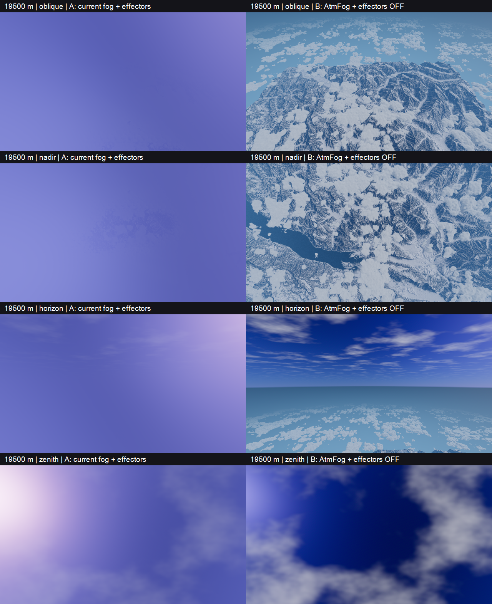
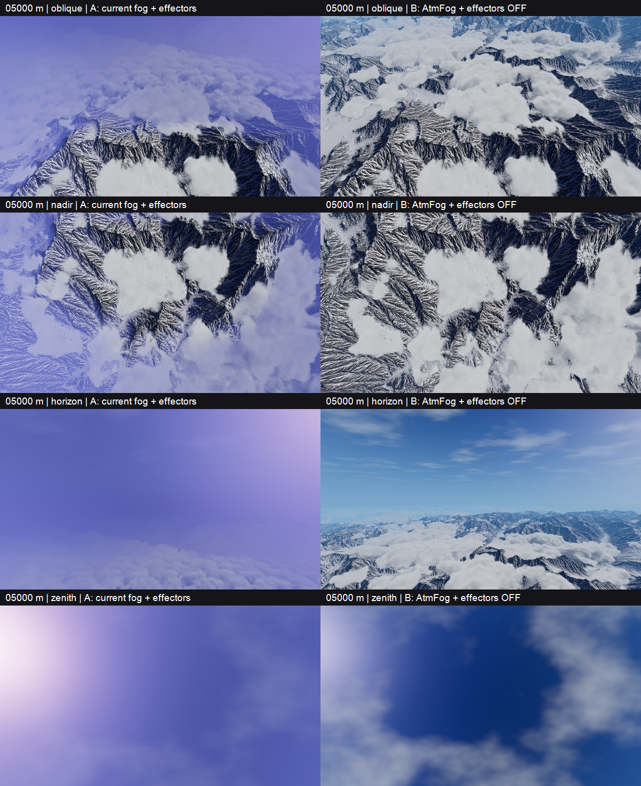

# Stadio A — confronto atmosferico eseguito

**8 settembre 2026 · Diagnosi, non nuovo preset di produzione.**

## Risultato

**Il lavaggio blu-viola è reale e viene eliminato dalla disattivazione congiunta di AtmFog e grandi effectors periferici. Il bordo geometrico, però, resta nettamente visibile a 19,5 km.**

Quindi i due problemi sono distinti: la configurazione attuale nasconde il terreno, mentre toglierla non crea continuità oltre il terreno. Non serve aumentare ancora la fog.

### 19,5 km — A a sinistra, B a destra



- **Obliqua:** A è quasi interamente un campo blu-viola; B restituisce terreno e nubi, ma mostra il termine netto della superficie dettagliata.
- **Nadir:** in A si intravede appena il lago; in B lago, rilievi e distribuzione delle nuvole sono leggibili.
- **Orizzonte e zenit:** B recupera cielo scuro e struttura dei cirri. Resta uno stacco molto netto fra cielo e sfondo inferiore; non è ancora un risultato simile a Project Wingman.
- La prova non determina se ogni tratto del bordo visibile coincida col limite dei dati o includa limiti di clipmap/LOD: quel controllo resta aperto.

### 5 km — A a sinistra, B a destra



- Il vicino resta leggibile anche in A, mentre la patina domina la distanza e il cielo.
- B conserva molta più struttura del paesaggio, ma non viene promosso a look finale: contrasto lontano, raccordo del fondale e resa dall'alto richiedono ancora lavoro.

## Metodo e invarianti

Script ripetibile: [`tools/atmosphere_ab_survey.gd`](../tools/atmosphere_ab_survey.gd).

| Parametro | Prova |
|---|---|
| Scena | `scenes/maps/garda_lake.tscn`, caricata da disco in un processo separato |
| Rendering | Godot 4.7.1, Forward+, D3D12, AMD Radeon RX 9070 XT |
| Camera | X/Z = 0/0, quote Y = 5.000 e 19.500 m; non altezza AGL |
| Viste | 45° verso −Z, nadir, orizzonte verso −Z, zenit |
| Immagine | 1280 × 720, FOV 70°, near 1 m, far 100 km |
| Antialiasing | Impostazioni del progetto: scaling mode 2, scale 1, MSAA 0, TAA false |
| Luce | Ora 7,82 e sole della scena, energia 2; invariati |
| Fase nuvole | Vento/animazione CPU congelati; dither Sunshine `current_time = 0` |
| Assestamento | 96 frame renderizzati per cattura, `--fixed-fps 30` |
| A | AtmFog attivo, dieci effectors originali |
| B | AtmFog disattivato, lista effectors svuotata e dati ricaricati nel driver |
| Sunshine invariato | Attivo; atmospheric density 0,85; fog_effect_ground 1; colore (0,5; 0,65; 0,95); strato 750–2.300 m |
| Output | 16 catture A/B più una ripetizione A dopo B |

Il baseline A include le impostazioni applicate dal controller a runtime: non è la sola scena statica prima di `_ready()`. L'editor aperto e le sue eventuali modifiche non salvate non sono la sorgente della prova.

Le assert controllano inizializzazione del boundary, presenza di 626 regioni, spacing 4 m, background Terrain3D disattivato, camera valida, stato del quad fog, 20/0 vettori effector caricati e immutabilità dei parametri/fase Sunshine durante la cattura. Il driver viene fermato **dopo** l'ingresso nell'albero: fermarlo soltanto prima non era sufficiente a congelare la fase.

Non sono stati modificati shader, scene, preset condivisi, dati Terrain3D o maschere. `terrain.set_camera()` seleziona soltanto la camera diagnostica. Nessun `ResourceSaver`, salvataggio di scena o scrittura dentro `wc_data/`.

## Ripetibilità e misure

La prima vista obliqua a 5 km è stata acquisita **A → B → A_repeat**. La differenza RGB media assoluta fra A e A_repeat è **0,00000067** su scala 0–1, campionando un pixel ogni due in entrambi gli assi. Nella vista verificata non emerge una contaminazione temporale materiale dopo il cambio; non è una prova su ogni possibile vista o durante il volo.

Come indicatore descrittivo dell'intero frame, la deviazione standard della luma pesata sui valori sRGB è:

| Vista | A | B |
|---|---:|---:|
| 5 km obliqua | 0,1667 | 0,2497 |
| 19,5 km obliqua | 0,0425 | 0,1206 |
| 19,5 km nadir | 0,0596 | 0,1563 |

Formula: `(0,2126 R + 0,7152 G + 0,0722 B) / 255`. **Non sono radianza lineare, contrasto di una specifica coppia neve/roccia o misure di trasmittanza.** Le statistiche includono terreno, nuvole e sfondo; servono solo a documentare quanto A appiattisca le immagini mostrate.

## Verifiche eseguite e limiti

- Diff dei file già tracciati identico al precedente snapshot; `git diff --check` pulito. Preservato il lavoro preesistente.
- Check headless finale: **PASS**, nessun `SCRIPT ERROR` o `ERROR`.
- Cattura grafica finale: **PASS**, 17 PNG e manifest, nessun `SCRIPT ERROR` o `ERROR`.
- Restano warning dell'addon: deprecazione di `instance_reset_physics_interpolation` e rilascio incompleto di alcuni RID alla chiusura grafica. Non nascosti né risolti in questo task.
- Due errori nel primo harness sono stati corretti prima delle catture valide: array effectors non tipizzato e driver ancora in elaborazione dopo l'ingresso nell'albero. I tentativi precedenti non sono usati come evidenza.
- I due componenti vengono disattivati insieme: **non attribuire quantitativamente il miglioramento al solo AtmFog o ai soli effectors**. Per separarli servono ulteriori configurazioni.
- Nessun test in moto, benchmark GPU, cambio di sole o prova ai margini. Una fase congelata facilita il confronto, ma non valida dither/ghosting in volo.
- Nessuna prova C di match cromatico, nessun fondale nuovo e nessuna correzione delle unità Sunshine in questo stadio.

### Revisione indipendente completata

Il subagent `general-purpose` ha revisionato script, sorgenti, manifest e log in sola lettura: **nessun blocco per il confronto congiunto A/B**. Confermati congelamento della fase, commutazione fog/effectors, camera condivisa e assenza di salvataggi del terreno.

Restano tre limiti non bloccanti: ordine fisso A→B con repeat soltanto sulla prima vista, singola fase statica delle nuvole e assert valide nelle build debug, non nei template release. La revisione non sostituisce una prova in volo e non separa causalmente fog ed effectors.

## Ripetere la prova

Da PowerShell, nella root del progetto:

```powershell
$godot = 'C:\Users\sanna\Workspace\Godot\Godot_v4.7.1-stable_win64.exe'
& $godot --headless --path . --script tools/atmosphere_ab_survey.gd --quit-after 600 -- --check
& $godot --path . --script tools/atmosphere_ab_survey.gd --fixed-fps 30 --quit-after 3000
```

Verificare sia la riga `PASS` sia l'assenza di `SCRIPT ERROR`/`ERROR` nel log: il solo exit code di Godot non basta. Lo script mantiene assert deliberatamente vincolate al baseline esaminato; se cambia il preset, aggiornare consapevolmente la prova, non rimuovere i controlli per farla passare.

Originali e manifest del run valido:

`user://atmosphere_ab/2026-09-08T22-08-12-12812/`

Percorso locale:

`C:/Users/sanna/AppData/Roaming/Godot/app_userdata/Aero Demons/atmosphere_ab/2026-09-08T22-08-12-12812/`

Contiene `manifest.json`, `image-metrics.json` e i PNG originali. I due confronti incorporati sopra sono copie affiancate ridotte al 50%; nessuna correzione colore. Ogni nuovo run crea una directory distinta.

## Decisione successiva

**GO diagnostico:** partire da B per la prossima prova isolata, senza ancora renderlo permanente. Provare il raccordo cromatico C mantenendo camera, terreno, luce e Sunshine identici. Se il colore converge ma resta lo stacco fra dettaglio e campo uniforme, passare al minimo fondale separato con variazione spaziale.

**Non fare ora:** aumentare la fog, aggiungere nuove nubi periferiche o richiedere direttamente un export World Creator da 200 km. Questa prova conferma il problema, non decide ancora la dimensione o la tecnica del contesto esterno.
