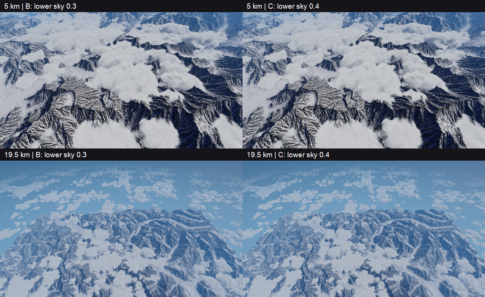
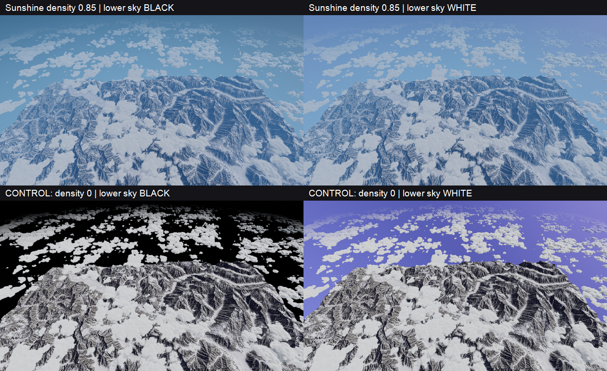

# Prova C — il colore inferiore di Sky3D non è la leva efficace

**8 settembre 2026 · 40 catture diagnostiche, nessun nuovo preset di produzione.**

## Esito

**Il solo `SkyDome.ground_color` non risolve il bordo con l'atmosfera Sunshine attuale.** La prova ordinaria B→C produce cambiamenti minimi. Il controllo nero/bianco mostra che Sunshine attenua fortemente l'influenza del cielo inferiore; azzerando soltanto la sua densità atmosferica, quella stessa leva torna chiaramente visibile.

Non è quindi corretto interpretare questa prova come dimostrazione che *qualsiasi* raccordo cromatico fallisca o che serva già un export World Creator enorme. Prima bisogna rendere controllabile il contributo atmosferico che domina effettivamente lo sfondo.

## B → C: un solo parametro



- **B:** AtmFog ed effectors off, `ground_color = (0.3, 0.3, 0.3, 1)`.
- **C:** stesso stato, solo `ground_color = (0.4, 0.4, 0.4, 1)`.
- Nessuna modifica a densità/colore/fase Sunshine, luce, shader o terreno nella prova ordinaria.
- Otto viste, come nello stadio A: due quote × obliqua/nadir/orizzonte/zenit.
- Sequenza **B → C → B_repeat in ogni vista**, 24 PNG. Il candidato 0,4 **non è un colore calibrato o approvato**: la scarsa sensibilità ha richiesto prima un controllo della leva.

Il terreno termina ancora nettamente nella vista obliqua a 19,5 km. Il nadir resta sostanzialmente invariato; lo zenit è identico sui pixel campionati, coerentemente con un parametro del cielo inferiore.

## Controllo della sensibilità



Due ulteriori run, ognuno con obliqua e orizzonte a 19,5 km, sequenza **B → nero → bianco → B_repeat**:

1. **Sunshine invariato, density 0,85:** estremi `(0,0,0,1)` e `(1,1,1,1)` del parametro Sky3D. Il cambiamento dello sfondo resta modesto.
2. **Controllo separato, density 0:** stessi estremi, nuvole ancora attive. La differenza nero/bianco diventa grande e immediata. Questo run **non è B della prova ordinaria, non è un look proposto e non mantiene invariato lo scattering**: è un controllo causale della sua influenza.

Ogni run mantiene costante la propria densità e tutti gli altri parametri Sunshine durante le commutazioni. I quattro valori del colore vengono verificati anche sul parametro effettivo del materiale, non soltanto sulla proprietà del nodo.

### Misure

Differenza RGB media assoluta su scala 0–1, valori PNG sRGB, un pixel ogni due in X/Y:

| Test, obliqua 19,5 km | Intero frame | ROI nello sfondo |
|---|---:|---:|
| 0,3 → 0,4; density 0,85 | 0,001364 | 0,000784 |
| Nero → bianco; density 0,85 | 0,020128 | 0,011035 |
| Nero → bianco; controllo density 0 | 0,156727 | 0,181536 |

ROI fissata sui PNG originali: `x=790, y=228, width=40, height=12`, sopra il bordo del terreno. La sensibilità nero/bianco in questa finestra cresce di circa **16,5 volte** togliendo la densità atmosferica Sunshine. È una misura dell'immagine composita, **non trasmittanza fisica**, né una segmentazione automatica di cielo/nuvole.

La differenza B/B_repeat resta sotto **0,000009** in tutte le viste dei tre run. I cambiamenti osservati superano quindi nettamente il residuo misurato dopo il ritorno a B. Non è una prova di stabilità in volo.

## Riscontro nelle sorgenti

- `addons/sky_3d/src/SkyDome.gd:150–154`: `ground_color` passa direttamente al materiale sky.
- `addons/sky_3d/shaders/SkyMaterial.gdshader:421`: il ramo inferiore usa `ground_color.rgb * scatter`; il bianco del parametro non deve quindi apparire bianco nel PNG.
- `addons/SunshineClouds2/SunshineCloudsPostCompute.comp:319–325`: i raggi senza geometria possono essere trattati come distanze molto grandi.
- Nello stesso file, `:349–377`: `fogEffectGround = 1` rende pieno il fattore `groundLinearFade`; il pass legge il colore della scena e lo miscela con il contributo atmosferico secondo il peso accumulato. La risposta osservata è coerente con questa forte copertura dello sfondo.

Il precedente problema delle unità nell'esponente atmosferico resta da correggere e verificare: **questa prova non lo corregge e non dimostra che sia l'unica causa** dell'aspetto corrente.

## Riproduzione e verifiche

Riutilizzato [`tools/atmosphere_ab_survey.gd`](../tools/atmosphere_ab_survey.gd), senza duplicare l'harness. Il comportamento A/B originale resta disponibile senza nuovi flag.

```powershell
$godot = 'C:\Users\sanna\Workspace\Godot\Godot_v4.7.1-stable_win64.exe'
# B/C/B, 8 viste
& $godot --path . --script tools/atmosphere_ab_survey.gd --fixed-fps 30 --quit-after 3000 -- --color-match
# Sensibilità nero/bianco, 2 viste
& $godot --path . --script tools/atmosphere_ab_survey.gd --fixed-fps 30 --quit-after 1800 -- --ground-probe
# Controllo separato della copertura atmosferica
& $godot --path . --script tools/atmosphere_ab_survey.gd --fixed-fps 30 --quit-after 1800 -- --ground-probe --no-scattering
```

Per il check di setup aggiungere `--headless` prima di `--` e `--check` dopo. Il flag `--no-scattering` è ammesso soltanto con `--ground-probe`. Le assert richiedono una build debug; verificare `PASS` e assenza di `SCRIPT ERROR`/`ERROR`, non il solo exit code.

Verifiche finali: **PASS** per i tre setup headless (A/B originale, colore, controllo senza scattering), **PASS** per tutti i 40 PNG e relativi stati nel manifest; nessun `SCRIPT ERROR`/`ERROR` nei tre run grafici. Restano i warning dell'addon già osservati nello stadio A. Diff dei file già tracciati identico allo snapshot iniziale e `git diff --check` pulito.

Rendering: Godot 4.7.1 Forward+ D3D12, 1280×720, FOV 70°, 96 frame di assestamento, sole e fase congelati come nello stadio A. I PNG affiancati sono ridotti al 50%, senza correzione colore.

Originali sotto `user://atmosphere_ab/`:

| Run | Directory | PNG |
|---|---|---:|
| B/C ordinario | `2026-09-08T22-16-30-13068` | 24 |
| Sensibilità | `2026-09-08T22-18-55-17016` | 8 |
| Controllo density 0 | `2026-09-08T22-19-55-13080` | 8 |

Ogni directory contiene il proprio manifest; `color-test-metrics.json` nel primo run raccoglie le misure. Radice locale: `C:/Users/sanna/AppData/Roaming/Godot/app_userdata/Aero Demons/atmosphere_ab/`.

## Decisione

**Fermare la taratura di `ground_color` sotto l'attuale copertura Sunshine.** Il prossimo intervento utile è lo stadio tecnico Sunshine già previsto: correggere coerentemente le unità nei due compute e ritarare con le stesse camere, mantenendo una sola autorità atmosferica. Solo dopo valutare il vero raccordo cromatico e l'eventuale fondale separato.

Terreno, export World Creator, scene e preset condivisi non sono stati salvati o modificati. Nessun nuovo fondale e nessuna modifica agli shader in questa prova.
