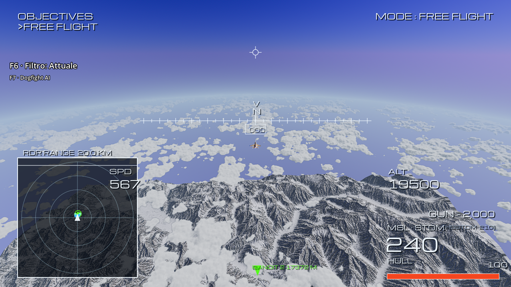
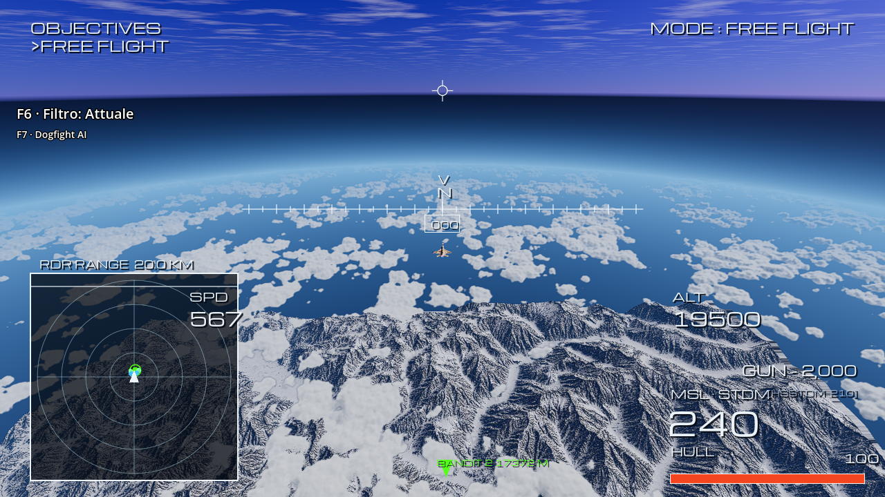
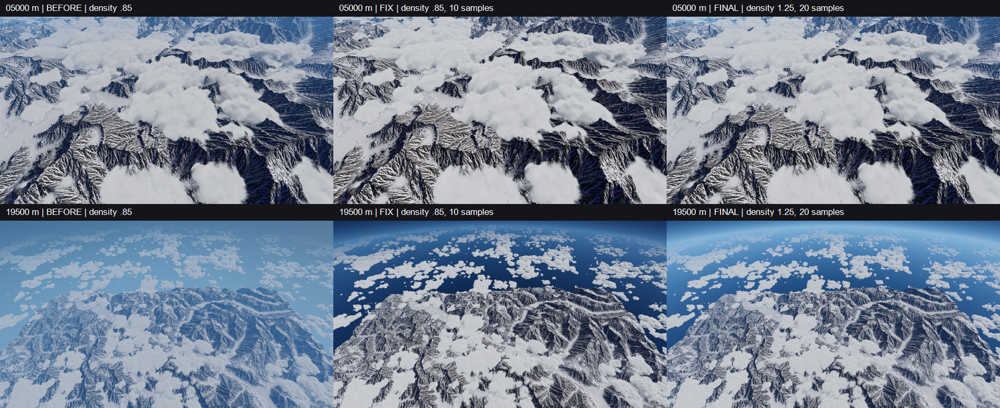
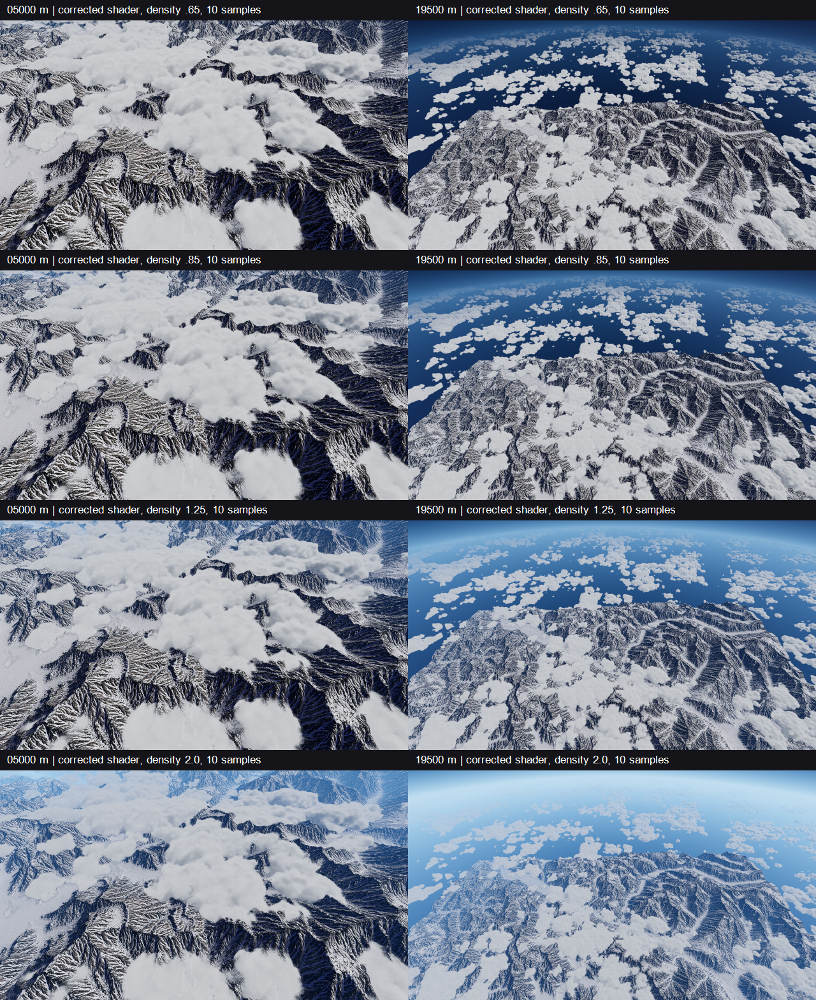

# Sunshine — correzione del profilo e prima ritaratura

**Aggiornamento 9 settembre 2026: U35 applicato e verificato con catture corrette. Cielo migliorato; bordo del terreno NON risolto.**

## Verifica finale U35 — 9 settembre

Il preset di produzione conserva densità 1,25 e 20 campioni, con `use_environment_fog = 0.35` e colori Sunshine `atmosphere_color`/`sampled_environment_fog_color = Color(0.518, 0.553, 0.608, 1)`. In `garda_lake.tscn`, SkyDome ha terreno bianco e cirri/cumuli disabilitati; il driver non campiona più il colore fog dell'Environment. AtmFog e anello di effectors restano spenti. Nessuna modifica a geometria, scala o dati World Creator.

**Verdetto visivo diretto:** sparita la fascia scura orizzontale; cielo blu con raccordo più continuo. Aereo e HUD leggibili nella camera di gioco a 2 e 15 km. Nella diagnostica inclinata di circa 25°, il taglio rettangolare rimane netto sia a 15 sia a 19,5 km. Questa è un'accettazione parziale del cielo, non del requisito originale né una corrispondenza completa a Project Wingman. La diagnostica usa una camera a 60 m dietro e 28 m sopra il velivolo: aereo piccolo, non la camera di gioco.

Produzione a 19,5 km:



Preset precedente, stessi shader corretti e stessa posa:



### Catture valide e correzioni del survey

- `2026-09-09T09-38-53-17212_orbit`: quattro immagini `15000/19500_prod/legacy.png`, manifest con posizione/base della camera e parametri effettivi.
- `2026-09-09T09-42-31-4748_gameplay`: sei immagini `2000/15000/19500_prod/legacy.png`, camera originale con elaborazione sospesa, senza sostituirne lo script.
- Directory sotto `user://atmosphere_ab/`. AI ferma, fase Sunshine congelata; non si pretende identità pixel delle animazioni materiali/particelle.
- Corretto l'azzeramento della posizione orbitale; disabilitata l'interpolazione fisica per le pose statiche. La proiezione si controlla nel rettangolo effettivo del viewport, non nelle dimensioni fisiche della finestra. Nessuna modifica alla camera di produzione.
- Ogni variante ripristina lo snapshot della produzione prima degli override legacy; testato il ciclo produzione → legacy → produzione. Corretto anche un errore runtime nell'array condizionale delle quote.
- `tools/tutorial_gameplay_capture.gd` riusa il survey orbitale: non conserva una seconda implementazione divergente del confronto.

**Evidenza esclusa, conservata su disco:** `2026-09-09T09-07-34-17020_orbit` riprendeva dall'origine sotto il terreno e la seconda variante produzione ereditava legacy. `2026-09-09T09-08-21-13384_gameplay` confrontava due preset equivalenti dopo la persistenza. Questi run non provano né la persistenza né la qualità del risultato.

### Verifiche rieseguite direttamente

```powershell
$godot = 'C:\Users\sanna\Workspace\Godot\Godot_v4.7.1-stable_win64.exe'
node tests/sunshine_atmosphere_check.cjs
& $godot --headless --path . --script tests/boundary_return_check.gd --quit-after 1200
& $godot --headless --path . --script tools/tutorial_orbit_capture.gd --quit-after 360 -- --check
& $godot --headless --path . --script tools/tutorial_gameplay_capture.gd --quit-after 360 -- --check
& $godot --path . --script tools/tutorial_orbit_capture.gd --fixed-fps 30 --quit-after 1200
& $godot --path . --script tools/tutorial_gameplay_capture.gd --fixed-fps 30 --quit-after 1200
```

Shader check e boundary check passano; entrambi i `--check` passano per snapshot, ripristino varianti e camera alle tre quote. Restano nei due check di cattura un warning di deprecazione e una risorsa ancora in uso in uscita; nei run grafici restano warning RID in uscita, senza errori di script/rendering durante le catture valide. Il solo exit code di Godot non basta: controllare marker PASS, errori di script e manifest completo. `git diff --check` pulito; diff tracciato identico allo snapshot precedente alla ripresa diretta, nessun diff `wc_data/`.

**Limite:** altro fog non fornisce i rilievi mancanti oltre il bordo. Per una continuità geometrica serve contesto distante esportato da World Creator; un eventuale fondale separato resta da valutare e non è stato aggiunto. Nessun ulteriore processo è stato terminato nella ripresa diretta. Il precedente `taskkill /IM` del subagent era per nome eseguibile, non per PID: non è una garanzia di selezione dei soli processi dichiarati.

---

## Resoconto storico — 8 settembre

**Applicata: densità 1,25, 20 campioni, una sola atmosfera. Il bordo a 19,5 km resta visibile.**



## Modifiche applicate

- `SunshineCloudsCompute.glsl` e `SunshineCloudsPostCompute.comp`: altezza in **metri** nell'esponente Rayleigh/Mie; normalizzazione a 40 km conservata soltanto per il fade artistico esistente. A 20 km il fattore Rayleigh è ora `exp(-20000/8000) ≈ 0,082085`, non circa 1.
- Quote negative limitate a zero nel profilo: nessuna crescita esponenziale sotto il livello del mare. Per una camera sopra quota zero, i raggi discendenti terminano l'integrazione al piano del mare o alla geometria, se più vicina; i raggi sky non attraversano più chilometri di atmosfera sotterranea fittizia. **È un limite matematico dell'integrazione, non nuova geometria.**
- Intervalli nulli/negativi restituiscono zero; campionamento ai punti medi, con lunghezza del segmento limitata alla profondità. Rimosso il vecchio ramo di campione parziale, che poteva usare una posizione precedente e dividere per zero campioni.
- L'integrale include già la lunghezza dei passi: eliminata la divisione finale per il numero di campioni. Il guadagno artistico `22/10 = 2,2` conserva la scala del vecchio caso a dieci campioni senza dimezzare artificialmente la luce passando a venti.
- Entrambi i chiamanti usano **20 campioni**. Nel post-pass il `smoothstep` con estremi identici, dal risultato non definito, è sostituito con `step`.
- `resources/environments/tutorial_clouds.tres`: **atmospheric_density = 1,25**. Il controller non sovrascrive più questo parametro a 0,85; il valore della risorsa è finalmente quello effettivo.
- `tutorial_boundary_controller.gd`: AtmFog tenuta spenta; anello periferico disattivato per default. Anche l'override serializzato `cloud_ring_count` in `garda_lake.tscn` è zero. Avviso e rientro morbido rimangono invariati.

Tutti gli altri valori già modificati nella risorsa, le modifiche utente estranee e i dati World Creator sono stati conservati. Nella scena cambia soltanto il conteggio degli effectors: nessuna proprietà Terrain3D modificata.

## Scelta della densità



Confrontati **0,65 / 0,85 / 1,25 / 2,0**, a sole, camere e fase delle nuvole identici. **1,25 è una prima scelta artistica**, non un coefficiente fisico né una soluzione del cutoff: recupera parte della luminosità del cielo lontano rispetto a 0,65–0,85, senza spingere fino al candidato 2,0. La scelta è stata poi verificata a venti campioni e con i nuovi default di produzione.

Il risultato conserva molto più contrasto sulle nuvole e sui rilievi rispetto al precedente lavaggio uniforme. La discontinuità fra terreno texturizzato e cielo inferiore, però, rimane evidente: non va nascosta aumentando ancora la densità.

## Verifiche

- **PASS** `node tests/sunshine_atmosphere_check.cjs`: identità delle due funzioni atmosferiche, espressioni scalari effettive degli shader, profili in metri, quote negative, distanze zero e raggi sky lunghi, guadagno indipendente dal conteggio e chiamanti coerenti a venti passi.
- Il controllo Rayleigh del kernel ottico, su un raggio verticale da 5 a 103 km, misura errore rispetto all'integrale analitico **5,99% a 10 passi → 1,55% a 20**. Non è l'errore della radianza finale né una validazione fisica completa del modello.
- **PASS** compilazione esplicita dei tre entrypoint: cloud compute, post normale e post MSAA. Il rendering visivo usa la configurazione corrente; non costituisce un confronto visivo separato di tutte le modalità MSAA.
- **PASS** setup headless del survey e **ALL CHECKS PASSED** per `tests/boundary_return_check.gd`, incluso il rientro reale del velivolo e la base finita in volo verticale. Il test ora fornisce una camera anche alla mappa isolata.
- Run finale: **16 PNG**, B/B_repeat su obliqua, nadir, orizzonte e zenit a 5 e 19,5 km. Tutti i manifest confermano AtmFog off e zero effectors caricati. Sole, camera e fase delle nuvole corrispondono al nuovo baseline acquisito prima della modifica.
- Differenza RGB media assoluta finale B/B_repeat: massimo **1,71×10⁻⁷** sui pixel campionati. Fra configurazione corretta a 10 e 20 campioni, a densità 1,25, massimo **0,004404**, nella vista obliqua a 19,5 km. Scala PNG sRGB 0–1, campionamento ogni due pixel; non misure di qualità o prestazioni.
- `git diff --check` pulito; diff tracciato estraneo ai file del task identico allo snapshot iniziale.

### Import: attenzione alla cache del post-pass

Il primo import automatico ha aggiornato soltanto il compute delle nuvole: **non basta verificare l'hash del `.comp` su disco**. Il run `2026-09-08T23-09-24-9016` è quindi escluso dai confronti: aveva la correzione applicata soltanto a uno dei pass. È stato conservato, non sovrascritto.

Aggiunto `--reimport` al survey per forzare la ricompilazione dei tre entrypoint tramite `EditorFileSystem.reimport_files`. API verificata nella documentazione Godot 4.7: <https://docs.godotengine.org/en/4.7/classes/class_editorfilesystem.html#class-editorfilesystem-method-reimport-files>.

**Il caricamento dell'editor non è pulito:** i log di import riportano asset stradali mancanti, nel primo tentativo anche un conflitto di copia DLL Terrain3D, e leak in uscita dal renderer dummy. Non sono stati corretti in questo task. La ricompilazione mirata dei tre shader passa e il run grafico finale non riporta `ERROR`/`SCRIPT ERROR`; restano i warning Sunshine già noti di deprecazione e RID in uscita.

## Riproduzione

```powershell
$godot = 'C:\Users\sanna\Workspace\Godot\Godot_v4.7.1-stable_win64.exe'
node tests/sunshine_atmosphere_check.cjs
& $godot --headless --editor --path . --script tools/atmosphere_ab_survey.gd --quit-after 600 -- --reimport
& $godot --headless --path . --script tools/atmosphere_ab_survey.gd --quit-after 600 -- --check --scattering
& $godot --headless --path . --script tests/boundary_return_check.gd --quit-after 1200
& $godot --path . --script tools/atmosphere_ab_survey.gd --fixed-fps 30 --quit-after 2400 -- --scattering
# Override diagnostico, senza salvare il preset:
& $godot --path . --script tools/atmosphere_ab_survey.gd --fixed-fps 30 --quit-after 2400 -- --scattering --density=0.85
```

Le modalità A/B/C precedenti ricostruiscono esplicitamente fog, dieci effectors e densità 0,85 della diagnosi storica, soltanto a runtime. **Usano però gli shader attuali:** non ricreano il renderer difettoso originale. I PNG precedenti rimangono il riferimento visivo immutato. Riavviare la scena già in esecuzione per caricare la nuova pipeline.

Run sotto `user://atmosphere_ab/`, tutti a 1280×720, 30 FPS fissi e 96 frame di assestamento:

| Scopo | Directory |
|---|---|
| Baseline prima della correzione, densità 0,85 | `2026-09-08T23-06-46-2240` |
| Corretto, 10 passi, densità 0,85 | `2026-09-08T23-11-25-2588` |
| Corretto, 10 passi, densità 0,65 | `2026-09-08T23-12-49-15848` |
| Corretto, 10 passi, densità 1,25 | `2026-09-08T23-13-19-9552` |
| Corretto, 10 passi, densità 2,0 | `2026-09-08T23-13-48-3196` |
| Default applicati, 10 passi, densità 1,25 | `2026-09-08T23-20-31-16000` |
| Default applicati, 20 passi, prima del fix `step` | `2026-09-08T23-22-06-7860` |
| **Finale completo, 20 passi, densità 1,25** | **`2026-09-08T23-23-37-15160`** |

Il run finale contiene `manifest.json`, `metrics.json` e copie dei log di verifica. I manifest registrano gli hash sorgente dei due compute. Le immagini affiancate sono ridotte al 50%, senza correzione colore.

## Limite e prossimo passo

Il modello conserva coefficienti artistici, attenuazione approssimata e piano atmosferico a quota zero; **non è diventato un'atmosfera planetaria fisicamente corretta**. Non è stato eseguito un benchmark GPU né un volo visivo prolungato a tutte le quote.

Ora si può riprendere la prova del colore inferiore e del raccordo con un contributo Sunshine corretto e meno coprente. Solo se questo non basta si valuta un fondale separato; nessuna geometria esterna è stata aggiunta o autorizzata da questo risultato.
