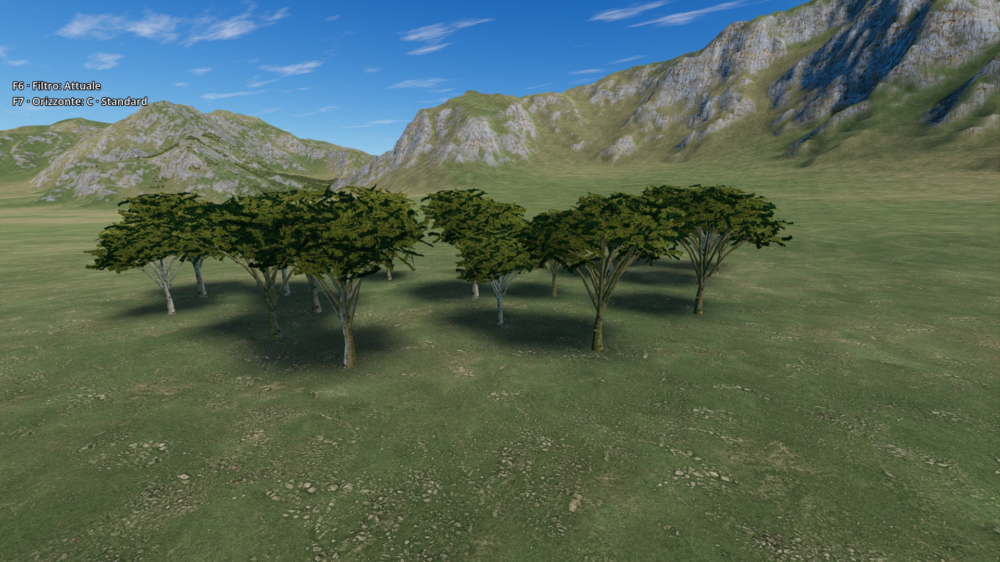
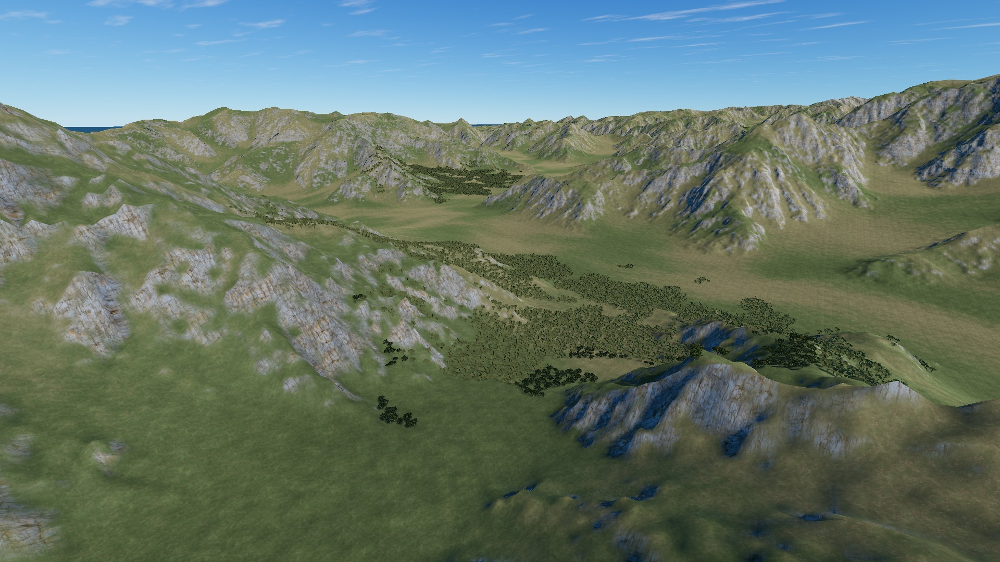
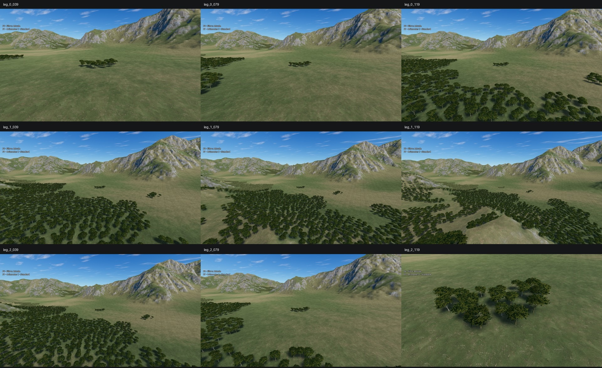

# Garda — alberi Blender e verifica runtime

> Baseline storica: geometria, densità, materiale e misure sono stati successivamente
> rivisti. Vedere il [report corrente del paesaggio](landscape-lookdev.md).

Sostituito il prototipo a grandi cartelloni con un albero costruito tramite
Blender MCP: tronco e rami tridimensionali, gruppi di foglie fotografici su
piccole superfici piegate e tre LOD. **Un modello**, variato per rotazione,
scala e tinta, non una libreria di specie. Solo Garda; superficie già approvata,
geometria del terreno, calibrazione, acqua e altre mappe non modificate da
questa sostituzione.



## Asset e integrazione

| LOD | Triangoli | Distanza nominale finale |
|---|---:|---:|
| 0: rami e fogliame dettagliati | 4.752 | 450 m |
| 1: rami e fogliame semplificati | 580 | 1.000 m |
| 2: proiezioni laterali + chioma dall'alto | 6 | 18.000 m |

Una superficie per LOD, materiale StandardMaterial3D condiviso, atlas RGBA 2048²
con mipmap e compressione BPTC. Alpha-scissor 0,15, nessun alpha blending
ordinato; dissolvenza pixel-dither finale fra circa 12 e 16 km. Questa
**non è una crossfade dei LOD**. LOD/culling nativi avvengono per cella MultiMesh,
non per singolo albero: le distanze non sono soglie esatte dalla singola pianta.

Configurazione Terrain3D 1.0.2: `last_lod=2`, `last_shadow_lod=2`,
`shadow_impostor=2`. Le mesh dettagliate non proiettano ombre: vicino e a media
distanza le fornisce un proxy shadows-only a sei triangoli. LOD2 proietta le
ombre oltre il range del proxy. Non moltiplicare i 4.752 triangoli per tutta
la foresta per stimare il lavoro di un frame.

- `assets/environment/garda_forest/garda_broadleaf.glb`: modello esportato.
- `resources/terrain/garda_surface_assets.tres`: slot mesh **1**, solo Garda.
- `resources/terrain/garda_tree_material.tres`: materiale condiviso.
- `scripts/maps/garda_forests.gd`: popolamento deterministico tramite
  `Terrain3DInstancer.add_transforms`, senza nodi/collisioni per albero.
- [Sorgenti, licenze CC0 e ricostruzione](../assets/environment/garda_forest/SOURCES.md).
- Copia Blender: `C:/Users/sanna/Workspace/3D_models/garda_broadleaf_game_ready.blend`.

I boschetti restano quelli del test iniziale: sette aree limitate, passo nominale
16 m, **39.564 alberi**, sotto il tetto di 60.000 senza troncare le patch.
Esclusi acqua/riva sotto 195 m, quote sopra 1.850 m, pendenze oltre 35° e un raggio
di 4 km dall'aeroporto. Non è una ricostruzione geografica dei boschi reali.
Il terreno non viene salvato; ogni lancio ricrea le istanze in memoria.

141 celle native, 564 MultiMeshInstance3D allocati fra tre LOD e proxy ombra;
**non sono 564 draw call contemporanee**. Nessun popolamento per-frame dopo
la costruzione. Il vecchio prototipo è stato archiviato negli artefatti esclusi
dall'import, non lasciato fra gli asset attivi.

## Prestazioni misurate

Godot 4.7.1, Terrain3D 1.0.2, Forward+/D3D12, AMD Radeon RX 9070 XT.
1920×1080 nativi, FOV 70, niente TAA/upscaling/cloud rendering, vsync disattivo.
Stesse istanze e camere; si alternano visibilità e ombre, senza ricostruzione.
Per ciascuna vista: `off, on, no_shadows, no_shadows, on, off`, 1,2 s di
assestamento e 2 s di campioni per modalità. I proxy shadows-only vengono
nascosti nel caso senza ombre, non convertiti in geometria visibile.

Valori GPU dell'intero viewport: media delle due mediane di ciascuna modalità.

| Vista | Senza alberi | Alberi + ombre | Alberi senza ombre | Incremento completo |
|---|---:|---:|---:|---:|
| Vicino | 1,3575 ms | 1,4720 ms | 1,4295 ms | +0,1145 ms |
| Volo basso | 1,6100 ms | 1,7200 ms | 1,6925 ms | +0,1100 ms |
| Crociera | 1,4045 ms | 1,4615 ms | 1,4600 ms | +0,0570 ms |

Draw call off/on: **115/255**, **111/258**, **40/137** rispettivamente.
I campioni completi, frame time e p95 sono in
[benchmark.json](images/garda-forest-review/benchmark.json).
Sono test statici controllati, **non FPS di gameplay né garanzie su GPU inferiori**.

Costruzione nel test grafico: 391,116 ms complessivi, patch più lunga 59,616 ms;
in freeroam osservati 801,113 ms complessivi. Il totale include attese fra patch.
La costruzione avviene all'avvio, una patch per frame: possibili scatti iniziali,
non una promessa di avvio senza hitch. Non è stato aggiunto uno streamer per
l'intera mappa da 250 km.



## Controlli eseguiti

- `tools/garda_forest_review.gd`: PASS sia headless sia grafico, exit 0 e marker
  `GARDA FOREST REVIEW PASS`, nessun errore script/assert/shader. Controlla
  determinismo, budget, esclusioni, appoggio/upright di tutte le istanze native,
  3 LOD, triangoli/superfici, mipmap, range e modalità delle ombre.
- Ultimo headless dopo la pulizia: PASS in 24,1 s; regressione della superficie
  `tools/garda_surface_review.gd -- --check`: PASS in 29,1 s, exit 0 e marker.
  La prova della superficie disattiva le foreste per isolare il materiale.
- **256 regioni `.res`**: numero, dimensioni e mtime invariati rispetto allo
  snapshot precedente alle foreste; altezze campionate invariate nel test.
  Non equivale a una nuova certificazione degli hash del DEM originale.
- Freeroam e tutorial lanciati tramite Godot AI MCP, `autosave=false`, entrambi
  confermati `live`. Verificati nel gioco `built=true`, 39.564 istanze,
  percorso del nuovo GLB, 3 LOD e proxy 2. Log correnti senza errori; nessun nuovo
  errore editor dal cursore di avvio. Entrambe le esecuzioni fermate.
- Nel freeroam: camera diagnostica mobile per tre tratti da 120 frame fisici,
  circa 40 m → 470 m → 1.070 m → 60 m dal bersaglio; nove immagini ispezionate.
  Player/HUD e driver nuvole disattivati solo in memoria per questa prova.
  Nessuna chioma rettangolare opaca o asset mancante nelle immagini;
  questa breve sequenza campionata **non dimostra assenza di popping/shimmering**
  durante un volo lungo o in tutte le condizioni di luce.
- Packing ripetuto dai bake finali su un PNG temporaneo: uguaglianza completa
  RGBA con l'atlas consegnato; controllo senza modificare l'asset attivo.
- Revisione diff e `git diff --check`.



Durante l'integrazione è emerso un conflitto creato da una copia temporanea di
`garda_final.tscn` con lo stesso UID: il freeroam caricava la vecchia mappa senza
`Forests`. Copia rinominata `.snapshot`, artefatti esclusi con `.gdignore`, scan
Godot completato; gli UID delle scene di gioco non sono stati cambiati. Il test
ora controlla anche che l'UID di Garda risolva alla mappa reale.

### Esecuzioni locali ripetibili

Dalla radice, col wrapper locale che impone deadline, marker, exit 0 e cleanup
del solo processo avviato (i log restano in `subagent-artifacts/`):

```text
python subagent-artifacts/garda-forest/run_check.py 120 "GARDA FOREST REVIEW PASS" delivery_headless --headless --script res://tools/garda_forest_review.gd
python subagent-artifacts/garda-forest/run_check.py 200 "GARDA FOREST REVIEW PASS" final_tree_render --script res://tools/garda_forest_review.gd -- --capture
python subagent-artifacts/garda-surface/run_check.py 120 "GARDA SURFACE REVIEW PASS" forest_delivery_surface --headless --script res://tools/garda_surface_review.gd -- --check
```

Il wrapper è un artefatto locale, non una dipendenza del progetto. Gli script
Godot sono versionabili ed eseguibili con `godot --path . --script <script>`;
in automazione mantenerli sempre sotto deadline con cleanup del processo.

### Warning e limiti rimasti

Avviso deprecazione `instance_reset_physics_interpolation()`; nel test grafico
anche warning RID in uscita (Compute/Shader/VertexArray/VertexBuffer/Sampler),
già osservati nella verifica della superficie. L'editor conserva vecchi errori
relativi a risorse stradali mancanti, non riprodotti nei log dei due lanci finali.
L'errore iniziale di eval su `Forests` assente appartiene alla diagnosi del
conflitto UID, non alle esecuzioni finali.

Gli altri problemi di baseline (hash geografico e resource leak nel vecchio test
di integrazione) restano descritti nel [report superficie](garda-surface-review.md);
non vengono dichiarati risolti da questo lavoro. Restano da verificare voli
prolungati, transizioni LOD/antialiasing in movimento e hardware meno potente.
