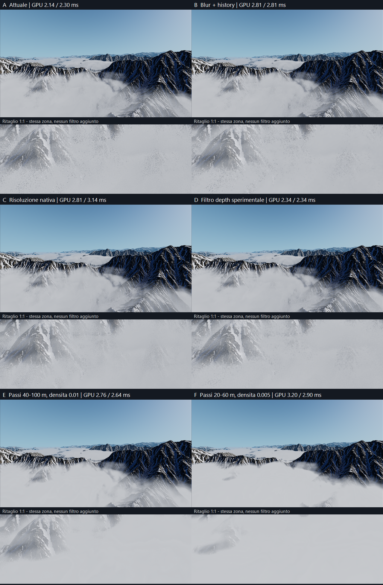
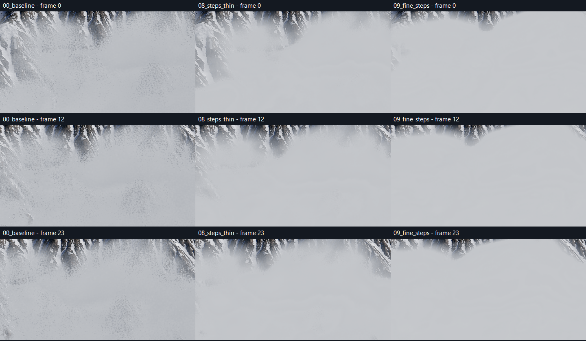

# Grana delle nuvole — confronto non distruttivo

## Esito

Il compromesso migliore fra le prove è **E / `08_steps_thin`**: passi di raymarch da 40–100 m, 900 passi massimi e densità 0.01. La grana diminuisce nettamente, ma anche il rilievo interno delle nuvole si attenua. Non è una pulizia a parità di aspetto: cambia l'integrazione del volume e quindi la sua opacità apparente.

**Nessuna variante è stata applicata al preset attivo.** Scene, terreno e file dell'addon non sono stati salvati dagli esperimenti.

## Confronto visivo

Aprire il PNG al 100% per giudicare la grana: le miniature ridimensionate la nascondono. Ogni pannello contiene una vista generale e un ritaglio 1:1 della stessa zona.



- **A — attuale:** banchi leggibili, ma evidente puntinatura dove il terreno emerge dalle nuvole.
- **B — blur + history:** il colore diventa più morbido; la puntinatura sulle intersezioni resta. Il costo non giustifica il risultato.
- **C — risoluzione nativa:** grana più fine, non eliminata; conserva meglio l'aspetto originale rispetto ai passi ridotti, ma costa di più.
- **D — filtro dei dati di distanza:** attenua alcuni punti duri, senza ripulire davvero le intersezioni. È una modifica shader sperimentale, non una soluzione pronta.
- **E — passi 40–100 m, densità 0.01:** migliore compromesso osservato; meno grana e meno dettaglio interno. Resta del rumore nelle transizioni.
- **F — passi 20–60 m, densità 0.005:** ancora meno puntinatura, ma il banco diventa molto uniforme e nasconde più terreno. Non lo preferisco per l'obiettivo Project Wingman.

### Movimento



Ritagli dei frame 0, 12 e 23 della stessa traiettoria. E conserva il vantaggio visivo nelle posizioni campionate; F tende a una massa piatta. Questa breve sequenza non dimostra l'assenza di ghosting durante virate rapide e non è una misura numerica del rumore temporale.

## Prestazioni

Godot **4.7.1**, Forward+, **D3D12**, **RX 9070 XT**, viewport **1920×1080**, scala 3D 1.0. Mappa tutorial isolata, senza aereo, HUD o combattimento. Due viste: spawn a quota 2000 m e sotto il banco a quota 1070 m.

Per ciascuna vista: 3 secondi di assestamento e 2 secondi di campionamento, mediana del tempo GPU del viewport. VSync e limite FPS disattivati durante la misura. Acquisizione PNG esclusa dalla finestra misurata. Il vento è fermo per mantenere le strutture confrontabili; il dither continua ad aggiornarsi.

**Sono tempi GPU dell'intero viewport, non del solo pass nuvole e non FPS di gameplay.** Le percentuali confrontano la media delle due mediane con la baseline della stessa esecuzione; sono indicative, non intervalli di confidenza. Non è stato eseguito un benchmark in ordine randomizzato.

| Variante | GPU spawn | GPU sotto banco | Incremento medio | Valutazione |
|---|---:|---:|---:|---|
| Attuale | 2.14 ms | 2.29–2.30 ms | — | Riferimento |
| 01 — blur + history | 2.81 ms | 2.81 ms | +27% | Più morbida, grana ancora evidente |
| 02 — nativa | 2.81 ms | 3.14 ms | +34% | Grana più fine, non risolta |
| 03 — passi 40–100, densità 0.025 | 2.70 ms | 2.49 ms | +17% | Troppo opaca |
| 04 — nativa + history | 2.81 ms | 3.14 ms | +34% | Nessun vantaggio statico decisivo rispetto a 02 |
| 05 — filtro depth 3×3 | 2.34 ms | 2.34 ms | +6% | Miglioramento parziale; shader sperimentale |
| 07 — dither fisso | 2.25 ms | 2.18 ms | Circa invariato | Elimina i puntini, introduce enormi bande: scartata |
| **08 — passi 40–100, densità 0.01** | **2.76 ms** | **2.64 ms** | **+22%** | **Compromesso consigliato, con perdita di rilievo** |
| 09 — passi 20–60, densità 0.005 | 3.20 ms | 2.90 ms | +38% | Più uniforme e coprente, poco convincente esteticamente |
| 10 — fade sulla profondità del terreno | 2.29 ms | 2.29 ms | +3% | Cambia il contatto con il terreno senza risolvere la grana |

Per 08 il costo aggiuntivo rispetto alla propria baseline è **+0.62 ms allo spawn / +0.35 ms sotto il banco**.

## Cosa indicano le prove

Il problema non è soltanto il dettaglio delle noise texture che definiscono la forma delle nuvole. Lo shader sposta stocasticamente i campioni del raymarch; con passi attuali da 80–300 m questo contribuisce a una forte puntinatura, soprattutto sulle intersezioni col terreno. Sostituire il dither con un valore fisso trasforma i puntini in bande: è una prova diagnostica, non un fix utilizzabile.

Aumentare la risoluzione riduce la dimensione dei punti, non la causa del campionamento. Il blur del colore e l'accumulo più forte non bastano. Il filtro sperimentale dei dati di distanza migliora qualcosa ma non conferma che quello sia l'unico responsabile.

Ridurre i passi funziona meglio fra queste prove, ma richiede ritarare la densità: non si può assumere che più campioni mantengano automaticamente la stessa opacità. Le varianti 03, 08 e 09 mostrano questo compromesso. Nessuna è un denoiser che conserva perfettamente il volume originale.

## Parametri provati

Tutti i valori non elencati restano quelli del preset attivo; quota, coverage, gradient e noise texture non cambiano.

| ID | Override |
|---|---|
| 01 | `accumulation_decay=0.92`, `blur_power=4.0`, `blur_quality=3.0` |
| 02 | `resolution_scale=0` |
| 03 | `min_step_distance=40`, `max_step_distance=100`, `max_step_count=900`, `clouds_density=0.025` |
| 04 | `resolution_scale=0`, `accumulation_decay=0.9`, `blur_power=2.5` |
| 05 | Media gaussiana 3×3, pesi 1–2–1, dei dati campionati da `input_data_image` nel post-pass |
| 07 | `ditherValue=0.5` nel compute shader |
| 08 | `min_step_distance=40`, `max_step_distance=100`, `max_step_count=900`, `clouds_density=0.01` |
| 09 | `min_step_distance=20`, `max_step_distance=60`, `max_step_count=1500`, `clouds_density=0.005` |
| 10 | Prima del campionamento della densità: `depthFade = 1.0 - smoothstep(linear_depth - maxstep, linear_depth, traveledDistance)` |

Le prove shader sono state caricate mediante una sottoclasse temporanea che ricompila i pass dopo `initialize_compute()`. Il primo tentativo di patch del post-pass veniva sovrascritto dalla reinizializzazione: **l'esecuzione 14:45:17 è esclusa**. La tabella usa soltanto le prove successive con la patch effettivamente installata.

## Artefatti e integrità

Screenshot completi, 24 immagini di movimento per variante e `results.json` sono in:

```text
%APPDATA%/Godot/app_userdata/Aero Demons/
  cloud_grain_2026-09-08T14-41-19/  # baseline, 01–04
  cloud_grain_2026-09-08T14-50-18/  # baseline, 05, 07, 08
  cloud_grain_2026-09-08T14-55-13/  # baseline, 09, 10
```

Script e log originali: `%LOCALAPPDATA%/Temp/aero-cloud-grain-1788871201480/` (`compare.gd`, `compare-root.gd`, `compare-final.gd`, `probe_clouds.gd`). Sono esperimenti temporanei, non nuovi componenti del gioco.

Verifica SHA-256 prima/dopo superata per `tutorial_clouds.tres`, `tutorial_cloud_height.tres`, `SunshineClouds.gd`, `SunshineCloudsCompute.glsl` e `SunshineCloudsPostCompute.comp`. Le modifiche preesistenti nel worktree sono state preservate. Nessuna scrittura del terreno è prevista negli script di confronto.

**Scelta suggerita:** valutare E se si accetta un banco più morbido. Se è indispensabile conservare il rilievo attuale, non promuovere nessuna prova come fix definitivo: serve ulteriore lavoro sul campionamento/ricostruzione, con validazione in volo.
