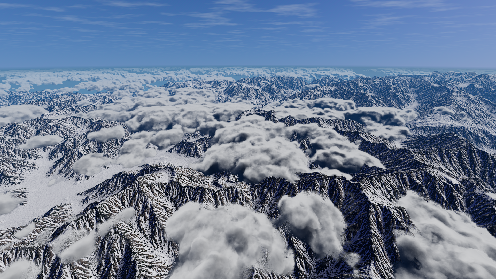
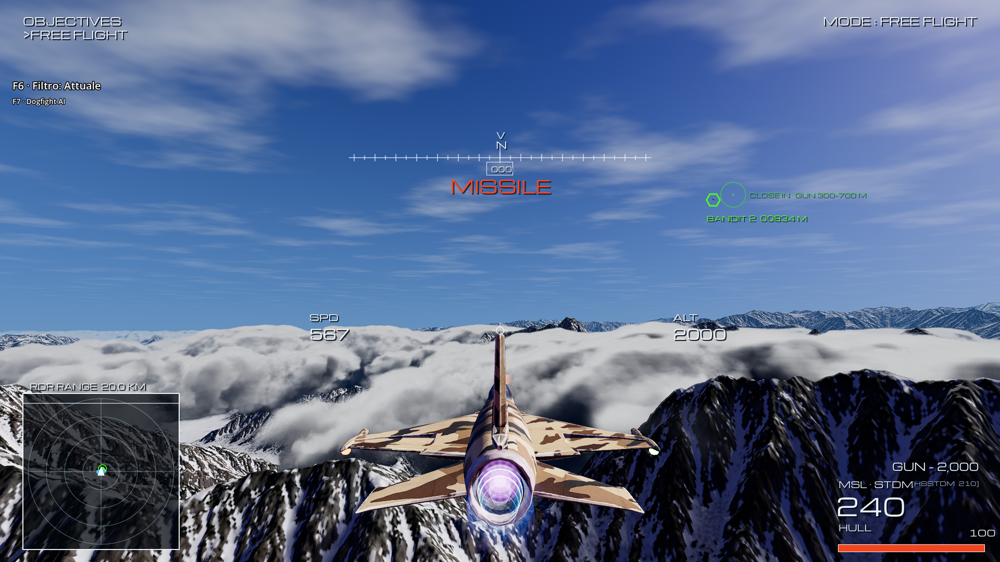
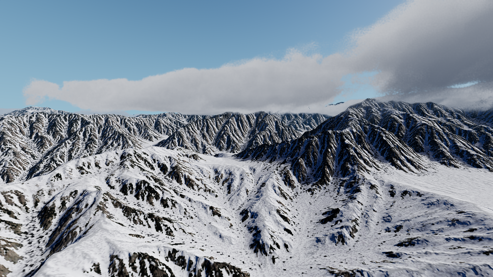
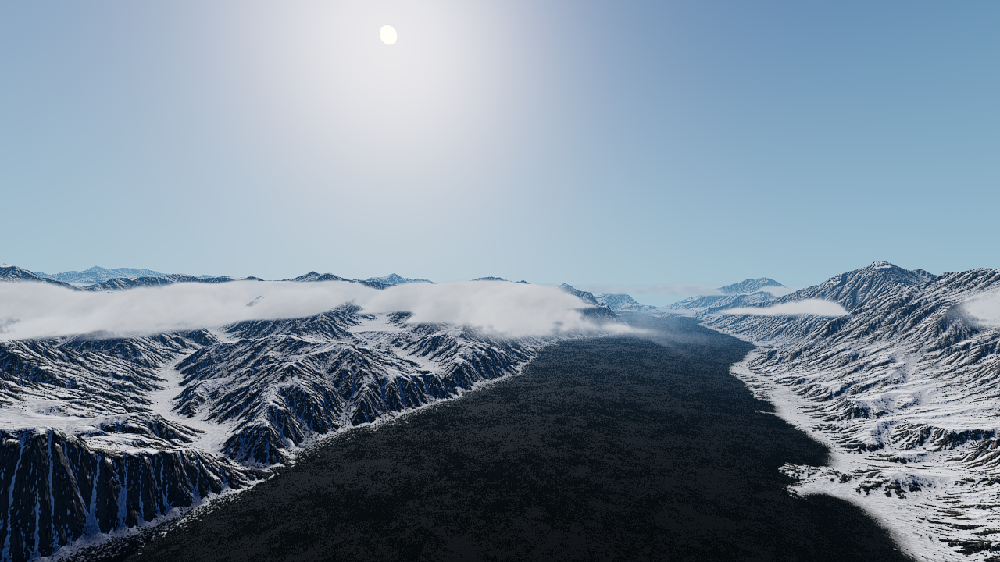
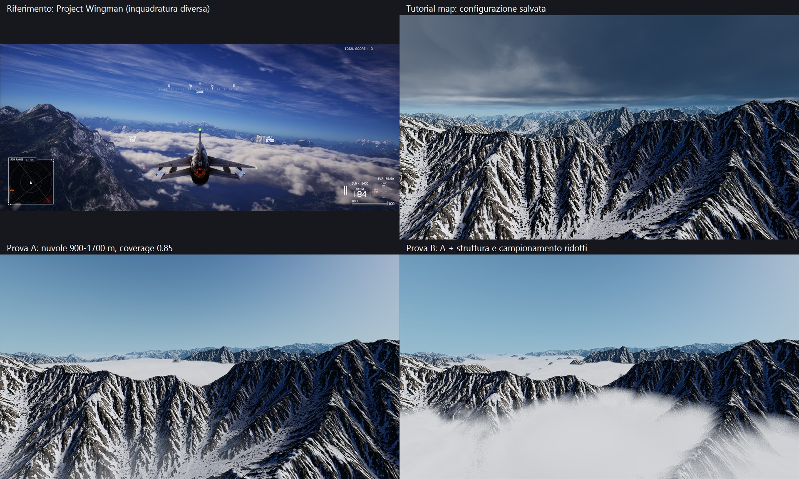

# Tutorial map → resa Project Wingman

**Analisi del 8 settembre 2026.** Riferimenti: i tre screenshot forniti dall’utente; stato del progetto verificato su disco e con nuove catture runtime. Questo documento definisce una direzione artistica e un piano di lavoro: **non applica un nuovo preset alla mappa**.

## Aggiornamento — rilievo dall’alto e cirri, attivo in freeroam (8 settembre 2026)

Dopo il feedback sulla variante E troppo piatta, applicata una nuova taratura a `tutorial_clouds.tres` e allo SkyDome di `tutorial_map.tscn`, usati anche da freeroam. Le sezioni successive descrivono prove storiche, non il preset attivo.

- Banchi fra **750 e 2.300 m**, coverage **0,77**, densità **0,04**; noise large/medium/small **12.000 / 2.200 / 600 m**. Maggiore spessore e variazione tridimensionale per sommità arrotondate e aperture fra i banchi.
- Lighting density **10**, sharpness **1,2**, powder **0,35**, ambiente blu scuro: recuperano ombre interne, perse riducendo la densità nella variante E.
- Passi **50–140 m**, massimo **700**, risoluzione nuvole **nativa**, history **0,85**. La grana non è completamente eliminata; la risoluzione nativa ne riduce la dimensione senza aumentare il blur.
- Cirri Sky3D attivi, cumuli Sky3D disattivati; Sunshine rimane l’unico sistema volumetrico basso. Cielo e atmosfera ritarati verso il blu dei riferimenti. Nessuna modifica al sole del terreno, al gradient o agli shader.





**Costo misurato:** 3,80 / 4,65 / 4,70 ms GPU del viewport nelle viste spawn / sopra i banchi / bacino ovest, a 1920×1080, Godot 4.7.1, D3D12, RX 9070 XT. Mediane su 2 secondi dopo 3 secondi di assestamento; mappa isolata e vento fermo, non benchmark del combattimento. La stessa forma a metà risoluzione e history 0,7 misurava 2,61 / 2,77 / 2,80 ms, ma mostrava puntinatura più grossa. La versione salvata privilegia la qualità richiesta; il costo a risoluzioni superiori va misurato.

Prove e misure in `user://cloud_relief_2026-09-08T15-33-36/`, `17-30-19/`, `17-33-01/`, `17-34-52/` (le ultime tre con lo stesso prefisso `cloud_relief_2026-09-08T`). Script, log e backup precedenti alla taratura in `%TEMP%/aero-cloud-relief-1788874370480/`.

Verifica di caricamento nella vera scena freeroam superata: parametri salvati e flag shader cirri/cumuli corretti; tre catture durante il volo automatico nei primi 8 secondi. Nessun errore rilevato; restano i warning preesistenti di deprecazione e rilascio RID alla chiusura. Non è una certificazione di assenza di ghosting in virate rapide. SHA-256 invariati per **725 file** di `wc_data/` e `addons/SunshineClouds2/`; diff della scena limitato al cielo. Terreno e acqua non sono stati modificati: la corrispondenza complessiva con il paesaggio dei riferimenti resta parziale.

## Aggiornamento — profilo e illuminazione delle nuvole (8 settembre 2026)

Applicato `resources/environments/tutorial_cloud_height.tres`, dedicato alla tutorial map: ingresso più graduale nella base, corpo centrale e sommità assottigliata. I canali non sono colori visibili: R modula la forma principale, G l’erosione fine, B la maschera ampia, A attenua il curl. Il profilo originale dell’addon resta intatto.

Rispetto alla prima prova, in `tutorial_clouds.tres`: medium noise 4.500 → 3.000; lighting density 0,65 → 1; lighting sharpness 0,4 → 0,65; powder 0,35 → 0,45; ambient color (0,62; 0,7; 0,8) → (0,48; 0,56; 0,68). Quote 900–1.800 m, coverage 0,8, densità 0,065, sole, campionamento e risoluzione invariati. Nessun intervento sul terreno o sullo shader.



La vista in salita mostra una base più irregolare e ombre interne più leggibili rispetto alla prima prova. Il bacino resta aperto. **Grana dei bordi e tendenza a formare fasce orizzontali non sono eliminate**: il profilo migliora la transizione, ma non rimuove i limiti del volume e del raymarch. Scartate una variante troppo continua e una che svuotava troppo i banchi; le modifiche combinate non isolano il contributo di ogni parametro.

Verifica finale: otto viste in `user://tutorial_survey/2026-09-08T14-19-11/`; percorso diagnostico completo di 56 s e sette catture in `user://tutorial_survey/low-cloud-flight-2026-09-08T14-21-10/`; controllo headless `tools/tutorial_survey.gd -- --check --flight` superato. Catture statiche, non una certificazione dell’assenza di ghosting in video o della leggibilità in combattimento.

Benchmark: tre coppie alternate, 1920×1080, FSR2 nativo, RX 9070 XT, 5 s warm-up e 12 s di rotta per misura. Mediana delle tre mediane GPU: **2,196 → 2,249 ms**, circa **+0,053 ms / +2,4%**; frame time 2,380 → 2,436 ms; mediana dei P99 6,542 → 6,608 ms. Sono misure della sola rotta, con editor aperto, non un limite massimo del costo. Risultati: `user://cloud_volume_benchmark_2026-09-08T14-28-34.json`.

Il confronto richiama `refresh_compute()` dopo ogni cambio di profilo per ricostruire i binding delle texture. La prima misurazione delle 14:24:45, priva di refresh, è scartata: il cambio di risorsa CPU non garantisce da solo che il compositor ricrei il binding GPU. Il benchmark corretto termina e salva sei misure; restano segnalazioni di rilascio risorse alla chiusura, non corrette qui.

Diagnostica e backup della prima prova in `%TEMP%/aero-cloud-volume-1788869246390/`. Per vedere il nuovo profilo nel gioco, riavviare la scena: non affidarsi al solo hot reload del file `.tres`.

## Aggiornamento — prima prova applicata (8 settembre 2026)

**Vincolo di progetto:** il terreno proviene da World Creator. Geometria, composizione e distribuzione/maschere delle texture si modificano lì, non in Godot. Registrato in `AGENTS.md`; le proposte sul terreno nel rapporto originale sono indicazioni per World Creator, non interventi autorizzati nel repository.

È ora attiva una prima prova in `resources/environments/tutorial_clouds.tres`. Le sezioni successive documentano la baseline storica precedente, non i nuovi valori.

| Parametro | Prima di questa prova | Preset applicato |
|---|---:|---:|
| Floor / ceiling | 2.000 / 6.000 m | 900 / 1.800 m |
| Coverage / density | 0,965 / 0,1 | 0,8 / 0,065 |
| Noise extra large / large | 180.000 / 65.000 | 60.000 / 18.000 |
| Noise medium / small | 14.000 / 4.200 | 4.500 / 1.200 |
| Curl strength | 4.500 (default) | 600 |
| Min / max step | 180 / 460 m | 80 / 300 m |
| Lighting travel distance | 14.000 m | 3.000 m |

Invariati atmosfera, energia del sole, Half resolution, limite di 300 passi, profilo verticale condiviso e shader. Nessuna modifica a terreno, materiali/maschere Terrain3D, cielo alto o acqua.



**Risultato:** creste emergenti e un’apertura più ampia sul bacino rispetto alla prova B. Non è un preset finale: restano grana sui bordi, volume interno poco contrastato e una base troppo orizzontale visibile durante la salita. L’attraversamento della fascia di quota è stato eseguito con camera diagnostica, non certifica ancora il volo dentro una nube densa, la stabilità temporale tramite video o la leggibilità in combattimento.

Verifiche eseguite:

- Otto catture statiche: `user://tutorial_survey/2026-09-08T13-53-08/`.
- Controllo headless del preset salvato e della rotta: `tools/tutorial_survey.gd -- --check --flight`, PASS. La rotta è stata traslata a X = −16.000 m nella valle occidentale: quella vecchia a X = 0 iniziava sopra la nuova base e falliva correttamente l’assert. Il terreno viene solo campionato, mai salvato.
- Percorso grafico completo di 56 secondi, basso passaggio/salita/discesa: PASS; sette catture in `user://tutorial_survey/low-cloud-flight-2026-09-08T13-58-39/`. Nessun errore di script nel percorso finale; warning RID alla chiusura.
- Benchmark freeroam a 1920×1080, FSR2 nativo, VSync off, RX 9070 XT: tre coppie alternate baseline/candidato, 5 s warm-up + 12 s di traslazione del player per campione. Stessi parametri non-cloud e reset delle posizioni del vento a ogni campione; niente modifica dei materiali del terreno.

| Mediana delle tre misure | Baseline | Nuvole basse |
|---|---:|---:|
| Tempo GPU mediano | 2,751 ms | 2,197 ms |
| Frame time mediano | 2,932 ms | 2,397 ms |
| P99 frame time | 4,796 ms | 3,956 ms |

Su **questa sola rotta** il costo GPU mediano diminuisce di circa il 20%. Non è un limite massimo né una garanzia generale: il terzo campione delle nuvole basse ha P99 6,955 ms, peggiore dei 5,716 ms della baseline nello stesso giro. Editor aperto durante la prova; nessun benchmark di combattimento o del caso peggiore dentro nuvole dense.

Risultati grezzi: `user://low_cloud_benchmark_2026-09-08T14-02-50.json`. Il benchmark raggiunge PASS e salva le sei misure, ma segnala errori di rilascio mesh/materiali/shader e risorse alla chiusura: **non è un'esecuzione senza errori di lifecycle**. Non sono stati corretti in questo intervento sul preset.

Copie diagnostiche e backup del preset precedente: `%TEMP%/aero-cloud-trial-1788868379553/`. I valori della tabella conservano nel report le differenze necessarie anche quando i temporanei verranno eliminati.

Per provarlo in gioco, riavviare la scena tutorial/freeroam. Per rivedere le otto inquadrature:

```powershell
& 'C:\Users\sanna\Workspace\Godot\Godot_v4.7.1-stable_win64.exe' --path . --script tools/tutorial_survey.gd -- --hold
```

Frecce sinistra/destra per cambiare vista; Escape per chiudere. Primo passo successivo: valutazione visiva dell’utente, poi profilo/base delle nuvole e loro illuminazione, senza intervenire sul terreno.

---

## 1. Verdetto

Possiamo avvicinarci sensibilmente al risultato con Terrain3D, Sky3D e SunshineClouds2 già presenti. **La priorità non è rendere più grande la mappa, ma cambiare il rapporto fra montagne, nuvole, materiali e atmosfera.**

Oggi la nostra immagine legge soprattutto come un massiccio molto innevato sotto un cielo coperto. I riferimenti leggono come una catena montuosa parzialmente innevata, con vallate scure, acqua blu, banchi nuvolosi bassi e un cielo azzurro attraversato da velature alte. Non è soltanto una differenza di qualità tecnica: è una diversa distribuzione delle forme, dei colori e dei contrasti.

Le cinque differenze più importanti sono:

1. **Nuvole troppo alte e spesse rispetto ai rilievi**, oltre che troppo continue nelle viste osservate.
2. **Terreno troppo uniformemente innevato e frammentato in bianco/nero**: il dettaglio fine compete con le grandi forme.
3. **Scarsa varietà atmosferica verticale**: manca il contrasto fra banchi bassi volumetrici, cielo libero e cirri sottili.
4. **Bacino presente, acqua dedicata non individuata nella scena**: mancano le proprietà visive che fanno leggere una superficie come lago o mare.
5. **Gerarchia dei piani e illuminazione da armonizzare**: non basta aumentare foschia, esposizione o risoluzione delle nuvole.

Una prova concreta conferma che **le creste possono emergere dalle nuvole già con il terreno attuale**. La stessa prova mostra anche che abbassare lo strato, da solo, non produce ancora nuvole simili a quelle dei riferimenti.



*Figura: in alto a sinistra il riferimento 13:24:57; in alto a destra la nostra baseline; sotto le prove A e B. Le tre viste della nostra mappa hanno la stessa camera. Il riferimento ha posizione, rapporto d’aspetto e risoluzione differenti: confronto di composizione, non confronto pixel-per-pixel. Immagini ridimensionate senza correzione del colore; originali disponibili nei percorsi della sezione 10.*

## 2. Cosa funziona nei tre riferimenti

### 2.1 Screenshot 13:24:26 — profondità e volume

La scena alterna masse scure di montagna, superfici bianche di neve e nuvole luminose. Le nuvole non sono semplicemente un velo: hanno sommità illuminate, fianchi e basi più scuri, bordi irregolari e aperture che lasciano leggere acqua e vallate. Alcune masse occupano il primo piano, mentre altre collegano visivamente rilievi intermedi e sfondo.

Le montagne emergono per una porzione importante, non soltanto con la punta estrema. Lo sguardo può seguire più catene verso l’orizzonte. L’aereo, con riflessi forti ma localizzati, fornisce un riferimento di scala e una superficie riconoscibile contro il paesaggio.

**Da riprendere:** alternanza di pieni e vuoti, rilievo interno delle nuvole, proporzione fra quota delle creste e sommità dello strato.

### 2.2 Screenshot 13:24:57 — varietà del terreno

La montagna vicina a sinistra non è una superficie uniformemente innevata: si distinguono roccia, zone scure/verdi, neve e una silhouette con elementi simili ad alberi. In basso l’acqua è una massa relativamente calma, blu scura, distinta dalla rugosità dei pendii.

Le nuvole sono distribuite a banchi; lasciano corridoi visivi e non sostituiscono tutto il paesaggio con un tappeto bianco. In alto compaiono filamenti chiari molto diversi dai volumi bassi.

**Da riprendere:** fasce ambientali, acqua come contrasto di superficie, vegetazione selettiva, separazione fra nuvole basse e velature alte.

### 2.3 Screenshot 13:25:16 — lettura dall’alto

Il punto di vista più alto mostra contemporaneamente nuvole sottostanti, molte cime libere e catene lontane progressivamente azzurrate e meno contrastate. Le nubi non cancellano l’identità geografica del livello. Anche senza un grande oggetto vicino, il paesaggio mantiene una scala leggibile.

**Da riprendere:** visibilità del terreno oltre il primo banco, perdita progressiva del contrasto con la distanza, orizzonte continuo.

### 2.4 Cosa gli screenshot non dimostrano

Non permettono di ricavare shader, tecniche di rendering, risoluzione delle heightmap, FPS, comportamento temporale o dimensioni reali del livello. Le quote dell’HUD non vanno trasferite automaticamente in metri Godot: qui non sono state verificate unità o convenzioni del gioco.

Non è necessario replicare l’implementazione interna di Project Wingman, che non conosciamo. L’obiettivo è riprodurre i segnali percettivi visibili. Le bande cinematografiche del primo screenshot e il formato ultrawide non sono caratteristiche del terreno.

## 3. Stato attuale verificato

La cronologia delle correzioni precedenti è in [tutorial-map-environment-review.md](tutorial-map-environment-review.md). Qui prevalgono i valori attuali dei file e le nuove esecuzioni: alcune sezioni storiche del documento precedente riportano preset poi sostituiti.

| Area | Stato verificato | Conseguenza per il riferimento |
|---|---|---|
| Motore | Godot 4.7.1, Forward+, D3D12; RX 9070 XT nel survey | I sistemi necessari al prototipo sono già disponibili |
| Terreno | Terrain3D 1.0.2; `vertex_spacing = 4.0`; 626 file regione | Non partiamo da una piccola superficie da estendere obbligatoriamente |
| Estensione | X −26.624…26.624 m; Z −26.624…24.576 m | Bounds di circa **53,25 × 51,20 km**, non tutta superficie giocabile continua |
| Quote | 0…3.468,276 m | Le montagne sono più basse del limite superiore delle nuvole |
| Nuvole | `cloud_floor = 2000`, `cloud_ceiling = 6000` | Strato nominale spesso 4 km; nessuna vetta supera il suo ceiling |
| Distribuzione | `clouds_coverage = 0.965`, `clouds_density = 0.1` | Nelle catture prevale una copertura estesa; coverage è un parametro dello shader, **non una percentuale misurata di cielo coperto** |
| Scale del noise | 180.000 / 65.000 / 14.000 / 4.200 | Scale dei domini di campionamento, non diametri letterali delle singole nuvole; vanno ripensate per banchi bassi |
| Profilo verticale | `HeightGradient.tres`, condiviso dall’addon | La forma dello strato dipende anche da questo, non solo da floor/ceiling |
| Campionamento | Half da default dello script; max 300 passi; distanze 180…460 m; max lighting 32 | Taratura nata per uno strato molto più spesso di un banco basso |
| Ricostruzione | Accumulo 0,7, blur 1,65 / qualità 2; dithering per pixel già corretto | Non ripartire dalla diagnosi vecchia come se queste correzioni mancassero |
| Atmosfera | Sunshine `atmospheric_density = 0.8`; fog Sky3D/Environment disattivata | **L’atmosfera esiste già**, ma la sua resa resta da armonizzare con il nuovo meteo |
| Luce | Sole terreno 2; driver nuvole ×0,3 → energia inviata 0,6 | Terreno e compositor hanno controlli distinti ma non effetti totalmente indipendenti |
| Ombre sole | Distanza massima 4.000 m | Le ombre geometriche lontane hanno copertura limitata; non significa che il terreno oltre 4 km sia privo di shading |
| Cielo alto | Cirri e cumuli Sky3D disattivati | Abbassate le nuvole Sunshine, emerge un cielo molto vuoto |
| Terreno/materiali | 7 texture asset: Mountain Side, Gradient, Vegetation 01/02, Snow, Flow, Debris | La palette di partenza c’è; la distribuzione non legge come nel riferimento |
| Filtraggio | 14 import albedo/normal con mipmap; sampler runtime anisotropici | Non manca semplicemente il flag mipmap |
| Antialiasing | FSR2 nativo scelto nel progetto; survey senza override AA | Il log `TAA=false` non equivale a “nessun filtro temporale”: FSR2 ha la propria ricostruzione |
| Proiezione | `enable_projection = false` nel materiale | Da provare sulle pareti ripide prima di aggiungere geometria o texture più grandi |
| Acqua | Nessun nodo/materiale dedicato trovato nella mappa o nel freeroam; ricerca testuale nei contenuti applicativi senza risultati | Il bacino scuro non va considerato automaticamente un’acqua già implementata |
| Vegetazione | Asset mesh generato con range 128 m; nessun asset albero nella lista del terreno | Le texture chiamate Vegetation non equivalgono a boschi leggibili a chilometri |
| Sfondo | `world_background = 0` | Aprire le nuvole espone più facilmente i limiti del terreno |
| Camera gioco | FOV base 70°, spawn a 2.000 m, far 100.000 m | Lo spawn coincide con l’attuale base nuvole; quota e inquadratura incidono moltissimo sulla percezione |

I valori `null` del dizionario shader Terrain3D **non sono automaticamente zero o false**: per stabilire lo stato effettivo di macro-variazione o altri parametri occorre leggere il materiale generato a runtime. Non li tratto come funzioni sicuramente spente.

### Lettura delle nuove catture baseline

- **Spawn:** montagne molto incise, neve bianca e roccia quasi nera; una grande base nuvolosa scura domina il cielo. Si vede molta geometria, ma poca articolazione del meteo intorno ai rilievi.
- **Est:** neve diffusa anche nei fondovalle, pareti con pattern allungati e frammentati. L’immagine legge come ambiente più glaciale di quello del riferimento.
- **Ovest:** grande bacino scuro, senza una risposta visiva evidente da superficie d’acqua; il rumore fine continua anche nella zona piatta.
- **Sopra le nuvole:** domina una distesa chiara, con poche aperture sul terreno. Non è la composizione dei riferimenti, dove resta leggibile una catena montuosa estesa.

## 4. Prove eseguite durante questa analisi

Ho riutilizzato `tools/tutorial_survey.gd`, senza salvare scene, materiali o regioni. Le varianti sono copie diagnostiche nella directory temporanea di Windows. Tre esecuzioni grafiche complete, otto PNG ciascuna: **24 catture**. Sono state esaminate le viste pertinenti, non certificata visivamente ogni singola cattura.

### Baseline — configurazione salvata

Nessun override. Confermati bounds, quote, energia del compositor e sampler Terrain3D. Questa è la base delle osservazioni sopra.

### Prova A — correggere quota e continuità dello strato

Override runtime:

```text
cloud_floor       2000 → 900
cloud_ceiling     6000 → 1700
clouds_coverage  0.965 → 0.85
```

Tutto il resto invariato, compreso il terreno.

**Esito:** le cime emergono e si leggono strisce di nuvole nelle depressioni. La relazione verticale richiesta è quindi ottenibile senza scalare la mappa. Tuttavia nello spawn resta una fascia quasi piatta e uniforme, e il cielo libero appare povero. Dall’alto la scena migliora come distribuzione, ma non ha ancora il volume e la morbidezza articolata di Project Wingman.

**Conclusione:** prova utile, non preset finale. Non dimostra che bastino tre parametri per raggiungere il risultato.

### Prova B — scala delle strutture e campionamento

Stesse quote/copertura della A, più:

| Parametro | Baseline/A | B |
|---|---:|---:|
| Extra large noise scale | 180.000 | 60.000 |
| Large noise scale | 65.000 | 18.000 |
| Medium noise scale | 14.000 | 4.500 |
| Small noise scale | 4.200 | 1.200 |
| Curl strength | 4.500, default script | 600 |
| Min step distance | 180 | 80 |
| Max step distance | 460 | 200 |

**Esito:** dall’alto compaiono banchi più articolati e meglio separati dai rilievi; nello spawn, però, cresce la massa bianca in primo piano, e da ovest una fascia continua nasconde parte della valle. Restano sommità poco scolpite e bordi granulari. **Non approverei B come configurazione finale.**

Questa è una prova combinata: non isola il contributo di ogni noise, del curl o dei passi. Mostra che la direzione è praticabile, ma che “noise più piccolo” non significa automaticamente “nuvole migliori”.

### Limiti importanti dei confronti

- Spawn e viste laterali conservano posizione e orientamento fra le tre esecuzioni. Le viste alte sono adattive: baseline a 7.800 m, A/B a circa 4.468 m. Il confronto baseline→candidato in quelle viste **non isola soltanto il meteo**; A e B condividono invece la stessa quota alta.
- Il survey usa FOV 70°, 1280×720 e non contiene player/HUD. I riferimenti sono 3439×1439, con camera differente. Il confronto riguarda il paesaggio, non il modello dell’aereo o la nitidezza a parità di pixel.
- Tre secondi di attesa per vista; vento e noise temporale non congelati. Non è un confronto pixel-identico né una misura di convergenza.
- Nessun nuovo benchmark GPU, test di combattimento, attraversamento continuo o verifica delle collisioni nelle prove A/B.
- Nessun `ERROR`/`SCRIPT ERROR` nei tre log finali. Restano warning di deprecazione e rilascio RID alla chiusura: esecuzione riuscita non significa assenza di problemi di lifecycle.

## 5. Interventi necessari, in ordine di impatto

### P0 — Definire una composizione verticale, non ingrandire alla cieca

Per il risultato cercato deve valere, in una parte significativa delle viste:

```text
fondovalle < sommità dello strato nuvoloso < creste importanti
camera di osservazione ≳ sommità delle nuvole
```

Non serve che tutta la mappa soddisfi sempre questa relazione. Servono una valle e un gruppo di creste riconoscibili che la mostrino bene, insieme a una rotta che permetta di passare sotto, dentro e sopra i banchi.

La configurazione attuale ha ceiling 6.000 m e massimo del terreno 3.468 m. Anche se il noise crea aperture, **non può esserci una vetta sopra il limite superiore dello strato**. È il motivo più concreto per cui i riferimenti sembrano lontani.

**Scelta consigliata:** mantenere inizialmente la scala del terreno; scegliere un corridoio rappresentativo e tarare lì quote nuvole/camera. La fascia 900–1.700 m è un primo esperimento riuscito sul rapporto verticale, non un vincolo da imporre a tutta la mappa. Prima del preset definitivo, campionare le quote delle creste lungo quel corridoio, non usare soltanto il massimo globale.

### P1 — Nuvole basse: forma, vuoti e illuminazione

Il target richiede banchi con variazione su tre scale:

- distribuzione ampia: dove c’è una distesa e dove passa un corridoio libero;
- corpi principali: gruppi e rigonfiamenti che si leggono da chilometri;
- erosione dei bordi: dettaglio fine, subordinato ai volumi e stabile in movimento.

**Percorso minimo con SunshineClouds2:**

1. Fissare floor/ceiling e camera della valle campione.
2. Tarare copertura e noise ampio per ottenere aperture significative. Non usare la sola densità per creare buchi: tende a rendere tutto trasparente invece di separare i banchi.
3. Tarare large/medium e il profilo verticale per avere sommità irregolari, non una lastra orizzontale.
4. Solo dopo intervenire su small noise, curl e blur. Il dettaglio di bordo non sostituisce un corpo principale convincente.
5. Bilanciare luce diretta, luce ambientale e occlusione delle nuvole guardando contemporaneamente cima, fianco e base, in controluce e con sole alle spalle.

Il profilo `HeightGradient.tres` è una risorsa multicanale usata dallo shader per influenzare forma, dettaglio e curl: **non è una semplice curva di opacità**. Per un futuro preset specifico della tutorial map, duplicarlo in una risorsa del progetto invece di alterare il file condiviso dell’addon.

Nel codice attuale la densità viene campionata da posizione world, noise e fascia di quota: non ho trovato nel percorso esaminato una heightmap Terrain3D che organizzi i banchi per valle. La profondità della scena interrompe il raymarch sul terreno visibile, ma **occlusione geometrica non equivale a distribuzione meteorologica legata al terreno**.

Se il noise globale non basta, riutilizzare prima la maschera ampia già prevista dall’addon (`extra_large_used_as_mask`, `update_mask`) per aprire due o tre corridoi. Verificarne coordinate, scala e movimento prima di dipingerla: una maschera di vallata deve restare ancorata alla geografia anche se i dettagli delle nuvole si muovono. Non partire da una simulazione meteorologica o da centinaia di volumi.

**Criterio di riuscita:** da sopra devono restare visibili diverse creste, porzioni di fondovalle e un’apertura sull’acqua; al passaggio laterale una nube deve leggere come volume, non come piano o parete di rumore.

### P1 — Campionamento: abbassare le nuvole richiede una nuova taratura

Uno strato spesso 800 m attraversato quasi verticalmente, con passi fra 180 e 460 m, dispone nell’ordine di pochi campioni lungo lo spessore. È una stima geometrica, non una misura dei passi effettivi: entrata nel volume, direzione, adattività ed early exit cambiano il risultato. Resta un rischio concreto di perdere il profilo e di mostrare bande/grana.

Due particolarità del codice impediscono di trattare i passi come un controllo di qualità indipendente:

- In `SunshineCloudsCompute.glsl` l’accumulo principale contiene `density += newdensity`: in quel punto non è normalizzato per la lunghezza del passo. Più campioni possono cambiare anche l’opacità percepita. La B diventa più invadente pur lasciando `clouds_density = 0.1`; il test non isola quanto dipenda da questo rispetto al nuovo noise.
- Il massimo teorico usa `stepCount * maxstep`: con 300 e 460 è 138 km; con 300 e 200 scende a 60 km. Sono limiti teorici, **non distanze garantite di nuvole leggibili**. Ridurre i passi può peggiorare il raccordo lontano se non si rivede il budget.

Quindi: tarare passi e densità insieme, controllare il risultato in movimento e misurare il costo. Non raddoppiare automaticamente tutti i passi di luce e non passare subito da Half a Native. La prova B è un punto diagnostico, non un’ottimizzazione dimostrata.

### P1 — Terreno: meno frammentazione, più fasce ambientali

Nei riferimenti la neve valorizza creste, canaloni e accumuli; sotto compaiono fasce scure di roccia e vegetazione. Nella nostra mappa neve e roccia si alternano con contrasto elevato praticamente ovunque, inclusi grandi fondovalle. Questo produce un’immagine “zebrata”, anche dopo la correzione di mipmap e aliasing.

**Il lavoro principale è sulle maschere e sulla direzione artistica, non sulla dimensione delle texture.**

Proposta per un solo settore:

- conservare neve abbondante sulle quote alte e negli accumuli coerenti;
- creare zone ampie di roccia esposta sulle pareti e fasce meno innevate in basso;
- distinguere ghiaioni, fondovalle, sponde e neve compatta senza distribuire sette materiali ovunque;
- usare quota e pendenza come base, aggiungendo correzioni artistiche per esposizione, canaloni e discontinuità; una soglia di quota perfettamente orizzontale sarebbe un nuovo artefatto;
- ridurre il contrasto delle micro-macchie prima di sfocare l’intero terreno;
- provare la proiezione nativa sulle pareti ripide e verificare normal/roughness. Le striature possono dipendere anche dalla geometria e dalle maschere, quindi non attribuirle tutte alle UV;
- verificare macro-variazione già disponibile prima di aggiungere uno shader custom. Aggiungere altro noise fine aggraverebbe il problema.

Conservare mipmap anisotropiche e FSR2 nativo. La stabilità temporale è una correzione tecnica già acquisita, non un sostituto della distribuzione artistica dei materiali.

**Criterio di riuscita:** a immagine ridotta devono distinguersi grandi masse roccia/neve/valle; il terreno non deve diventare una trama uniforme di puntini bianchi e neri. A distanza ravvicinata il materiale deve restare leggibile senza pareti palesemente stirate.

### P1 — Atmosfera, cielo alto e luce: un’unica immagine coerente

Non manca completamente la foschia: Sunshine applica già un contributo atmosferico. Il problema è stabilire una progressione credibile e mantenerla dopo il cambio di quota/copertura.

Obiettivo:

- vicino: contrasto sufficiente per leggere ostacoli e silhouette;
- medio: distinzione fra versanti e catene, senza rumore dominante;
- lontano: minore contrasto e colore più vicino all’orizzonte;
- cielo: azzurro più articolato, non semplicemente una tinta ciano uniforme;
- nuvole: alte luci chiare ma con variazioni leggibili, basi fredde senza diventare una coperta quasi nera.

Tarare su tre direzioni rispetto al sole e con esposizione fissa all’inizio. Conservare il moltiplicatore nuvole 0,3 come baseline: non tornare al vecchio problema di nuvole saturate aumentando subito la luce. Il driver sovrascrive i dati delle luci, quindi il futuro intervento va sul driver, non soltanto sul vettore salvato nella risorsa.

**Cirri alti:** nei riferimenti contribuiscono molto all’identità del cielo. Sky3D possiede già uno strato dedicato: provarlo prima di aggiungere un secondo raymarch volumetrico. Attenzione al master `clouds_enabled`: nel codice abilita sia cirri sia cumuli. Il risultato desiderato è **cirri del cielo + banchi Sunshine**, non due sistemi di cumuli sovrapposti. Verificare lo stato dopo `_ready` e gli aggiornamenti, non soltanto i flag nel `.tscn`.

**FogVolume:** tenerli come opzione locale per una valle importante, solo se il sistema esistente non basta. La fog volumetrica Godot distribuisce un budget finito sulla propria distanza: estenderla a decine di chilometri riduce il dettaglio disponibile. Aggiungerla su tutta la mappa insieme a Sunshine non è una scorciatoia gratuita e può introdurre sovrapposizioni/scie.

**Ombre:** conservare inizialmente i 4 km del sole; aumentare la distanza soltanto dopo aver dimostrato un problema nelle viste di confronto, perché allargare la copertura ridistribuisce la precisione delle shadow map. Le auto-ombre delle nuvole non dimostrano che esistano ombre nuvolose coerenti proiettate sul terreno: nel collegamento scena/materiale esaminato non emerge un’integrazione dedicata. Valutarla separatamente, non confonderla con `tracked_directional_light_shadow_steps`.

Il color grading è l’ultima rifinitura della palette, non il rimedio a neve distribuita male o a nuvole piatte. Bloom forte, esposizione automatica aggressiva e saturazione globale non sono priorità.

### P1/P2 — Acqua: il bacino è una buona base, ma serve una superficie

Nella vista ovest esiste una depressione adatta a una massa d’acqua; al momento non ho individuato una superficie dedicata nella scena. La sola regione scura del terreno non può offrire normale d’acqua, riflesso speculare coerente e risposta angolare indipendenti dal fondale.

**Primo prototipo consigliato:** un solo bacino, quota coerente con le sponde, mesh semplice e materiale d’acqua opaco per la lettura dall’alto. Colore blu scuro, roughness controllata, normal map moderata e riflessione del cielo sono più importanti di onde geometriche complesse o simulazione FFT. Evitare un piano enorme che allaghi indiscriminatamente tutte le depressioni.

Controlli indispensabili:

- sponde senza z-fighting o tagli netti fuori posto;
- distinguibilità rispetto a terreno, neve e cielo;
- speculare stabile durante il volo, senza scintillio ingestibile;
- nuvole davanti all’acqua correttamente composte;
- vista radente, vista alta e attraversamento delle nubi;
- quota del lago compatibile con la geometria del bacino.

Sunshine viene eseguito **prima delle trasparenze** (`PRE_TRANSPARENT`). Un’acqua alpha-blended può quindi comparire sopra nuvole già composte o non fornire la profondità attesa al raymarch. È un rischio d’integrazione da verificare, non un bug d’acqua osservato, dato che quel prototipo non esiste ancora. Partire opachi riduce questo problema e spesso basta da quota di volo; trasparenza e fondale vengono dopo, se servono.

Inoltre le nuvole Sunshine sono un effetto compositor, non automaticamente parte del materiale Sky3D: **non assumere che la riflessione del cielo le includa**. L’addon espone un collegamento per riflessioni via parametro shader globale, attualmente non configurato nella risorsa; valutarlo solo se il riflesso mancante risulta visivamente importante. SSR da solo non risolve oggetti fuori schermo o nuvole volumetriche non presenti come geometria riflettibile.

### P2 — Scala percepita, camera, vegetazione e sfondo

**Camera.** Prima di modificare il terreno, scegliere inquadrature confrontabili: una cresta vicina laterale, una valle in profondità e uno sguardo sopra i banchi. Il survey è una camera diagnostica; la camera del player ha inseguimento e FOV dinamico. Una montagna che occupa poco schermo può dipendere da distanza, orientamento e FOV, non dalla sua altezza assoluta. Il formato ultrawide dei riferimenti accentua il panorama: non confrontare la larghezza apparente direttamente con un 16:9.

**Vegetazione.** Nei riferimenti aggiunge scala soprattutto sulla cresta vicina e nelle fasce inferiori. I due asset texture Vegetation della nostra mappa non producono da soli alberi. Prima macro-distribuzione delle fasce boscate nel materiale; poi gruppi limitati di alberi con LOD/impostori nei tratti bassi e nei punti vicini alla rotta. Evitare milioni di alberi uniformi su una mappa di oltre 50 km per lato.

**Sfondo.** Abbassando/aprendo le nuvole i margini e la discontinuità all’orizzonte diventano più esposti; nelle prove alte restano fasce lontane poco convincenti. Il background NONE non viene corretto dal nuovo meteo. Riprendere eventualmente il prototipo su un solo bordo già suggerito nel documento precedente, non generare subito una corona completa. Confini e landmark erano rinviati: sono dipendenze future segnalate, non interventi applicati qui.

**Aereo e post-processing.** Il riferimento presenta riflessi e una silhouette dell’aereo che contribuiscono molto all’immagine finita. Questa analisi non include un nuovo confronto del nostro player: non attribuisco ai suoi materiali difetti non osservati. La validazione finale deve però includerlo, perché un ambiente piacevole nel survey può rendere bersagli/aereo poco leggibili in gioco.

## 6. Il raddoppio del terreno serve ancora?

**Non come primo intervento per questo obiettivo.**

La mappa ha già bounds di circa 53 × 51 km. La prova di nuvole basse mostra le vette emergenti senza cambiare una sola altezza. Il motivo iniziale per ingrandire il mondo viene quindi in larga parte risolto agendo sul rapporto fra strato nuvoloso e rilievi.

Scalare X/Y/Z di 2 darebbe bounds di circa 106,5 × 102,4 km e quota massima circa 6.936,6 m. Con le nuvole ancora a 2.000–6.000 m, solo i rilievi abbastanza alti supererebbero il ceiling; non si ottiene automaticamente la distribuzione dei riferimenti. Scalando anche le nuvole, invece, si conserva proprio il rapporto verticale che vogliamo cambiare.

Le prove precedenti in `tests/terrain_scale_check.gd` dimostrano conservazione dei campioni e costo simile **su una regione isolata**, non identità visiva o prestazionale del livello completo. Stessi campioni su distanze doppie significano meno dettaglio geometrico per metro. Inoltre non scalano automaticamente texture, spawn, acqua, distanze delle ombre, AI, velocità e durate dei percorsi.

Valuterei il ×2 soltanto se, dopo meteo e camera, servissero davvero valli più larghe o tempi di avvicinamento maggiori per il gameplay. È una decisione di scala del mondo, non un preset grafico.

## 7. Piano operativo consigliato

Lavorare su **una valle campione**, non su tutte le 626 regioni contemporaneamente. Ogni fase produce un confronto approvabile prima della successiva.

| Fase | Intervento | Dove | Criterio per procedere |
|---|---|---|---|
| 0 — Baseline | Fissare rotta, viste, risoluzione, esposizione, meteo di confronto | Riutilizzare survey e benchmark esistenti | Confronti ripetibili con quote annotate; vista anche dal player |
| 1 — Composizione | Banco basso con aperture; tarare profilo/scala/densità e passi | `tutorial_clouds.tres`; eventuale profilo dedicato in `resources/environments/` | Creste e valle leggibili, niente lastra bianca; attraversamento accettabile |
| 2 — Cielo e luce | Cirri Sky3D, gradiente del cielo, atmosfera e illuminazione delle nubi | `tutorial_map.tscn`, risorsa nuvole | Buona lettura sopra/sotto e rispetto a tre direzioni del sole |
| 3 — Fasce del terreno | Distribuzione neve/roccia/vegetazione su settore limitato; prova proiezione | Asset/materiale Terrain3D e sole regioni interessate | Forme leggibili da lontano e vicino, senza perdere stabilità temporale |
| 4 — Acqua | Prototipo opaco nel bacino campione, sponde e riflessi | Un nodo/materiale dedicato, se il prototipo è approvato | Acqua leggibile, compositing corretto con nuvole, costo accettabile |
| 5 — Validazione gioco | Player, nemici, scie, esplosioni; frame time e visibilità | Freeroam e strumenti di benchmark | Nessuna regressione rilevante di bersagli, traversata e prestazioni |
| 6 — Estensione | Replicare criteri approvati; vegetazione/sfondo selettivi | Solo aree che ne hanno bisogno | Coerenza del livello, non quantità di asset |

Le fasi 1–2 hanno il miglior rapporto fra impatto e invasività. La fase 3 è probabilmente il lavoro artistico più importante dopo il meteo. L’acqua è un’aggiunta sostanziale se l’obiettivo include davvero laghi/fiordi come nei riferimenti; non è obbligatorio implementare subito tutte le sue caratteristiche ravvicinate.

Non propongo una stima in giorni o una percentuale di “somiglianza”: mancano una rotta scelta, il target hardware minimo e l’approvazione dei primi confronti.

## 8. Prestazioni: cosa possiamo ragionevolmente aspettarci

Una migliore composizione può costare poco quando riusa gli stessi pass e dati, ma **non è dimostrato che un banco basso costi quanto lo strato attuale**. Cambiano i pixel coperti, il numero di campioni utili e l’early termination. Aprire le nuvole può anche far lavorare il raymarch più a lungo invece di saturare presto la densità.

| Scelta | Aspettativa, non misura di questa sessione |
|---|---|
| Cambiare floor/ceiling e maschere senza nuove texture grandi | Memoria dei dati potenzialmente simile; costo del raymarch comunque da misurare |
| Ritoccare control map e palette mantenendo gli asset | Non richiede per principio più triangoli o texture più grandi |
| Cirri nel cielo esistente | Evita un secondo sistema volumetrico; non significa costo nullo |
| Passi più piccoli o più passi di luce | Può aumentare il costo; modifica anche resa e portata nel codice corrente |
| Sunshine Half → Native | Circa 4× pixel del pass a pari viewport, non automaticamente 4× tempo totale del gioco |
| Fog volumetrica aggiuntiva/SSR/ombre più estese | Nuovi costi e interazioni; richiedono un beneficio visibile prima dell’attivazione |
| Raddoppiare X/Z mantenendo densità geometrica | Richiede molti più dati, a differenza dello stretching dei campioni già provato |

I vecchi benchmark FSR2 nel documento ambientale sono dati storici, non una misura del nuovo preset o del combattimento attuale. Le misure da circa 0,35 ms del test di scala non vanno usate come tempo del gioco completo.

### Protocollo minimo di accettazione

- Baseline e candidato a stessa risoluzione, FSR2 nativo invariato, stessa camera/rotta e impostazioni delle ombre.
- Almeno tre passaggi alternati, warm-up iniziale e del temporale; niente Movie Maker/fixed-fps per misurare prestazioni real-time.
- Frame time CPU/GPU, mediana e P95/P99, memoria video e tempi di caricamento; annotare processi/editor che condividono la GPU.
- Viste/rotte: sopra banco, dentro banco, valle bassa, orizzonte radente, acqua con nuvole davanti e combattimento con scie/esplosioni.
- Valutazione in movimento di grana, scie, ghosting, popping, leggibilità dei bersagli e occultamento del terreno.
- Target da concordare: per esempio 60 FPS implica 16,67 ms di budget totale, 120 FPS 8,33 ms. Sono budget, non prestazioni promesse su un hardware non specificato.

## 9. Cosa non fare adesso

- Non raddoppiare la mappa per risolvere un rapporto di quote.
- Non sostituire Sunshine prima di avere esaurito profilo, distribuzione e illuminazione del sistema già installato.
- Non aumentare indistintamente densità, passi e blur: possono produrre una lastra più costosa.
- Non riattivare tutto il meteo Sky3D insieme alle nuvole Sunshine: per i riferimenti serve soprattutto il livello alto sottile.
- Non coprire il mondo con FogVolume, alberi o particelle per nascondere materiali e composizione.
- Non passare direttamente a texture più grandi, SSAA pesante, GI o acqua con simulazione complessa.
- Non ridurre il contrasto di tutta l’immagine per correggere la sola neve; aereo, HUD e bersagli devono restare leggibili.
- Non modificare in massa le regioni senza backup e approvazione del settore campione.

**Primo intervento raccomandato:** costruire un preset di nuvole basse convincente nella valle campione, mantenendo terreno e scala attuali; affiancare poi cirri e un primo pass sulle fasce neve/roccia. Le prove A/B sono materiale diagnostico da cui partire, non una configurazione da salvare tale e quale.

## 10. Evidenze, riproduzione e fonti

### Screenshot di riferimento

Originali locali forniti dall’utente:

```text
C:\Users\sanna\Pictures\Screenshots\Screenshot 2026-09-08 132426.png
C:\Users\sanna\Pictures\Screenshots\Screenshot 2026-09-08 132457.png
C:\Users\sanna\Pictures\Screenshots\Screenshot 2026-09-08 132516.png
```

### Catture di questa analisi

Directory base:

```text
%APPDATA%\Godot\app_userdata\Aero Demons\tutorial_survey\
```

| Esecuzione | Directory |
|---|---|
| Baseline | `2026-09-08T13-28-39` |
| Prova A | `2026-09-08T13-31-11` |
| Prova B | `2026-09-08T13-32-29` |

Ogni directory contiene otto PNG e `views.json`. La figura nel documento conserva una sintesi portabile; le immagini originali restano fuori dal repository.

Log locali: `%TEMP%\wingman_review_survey.log`, `%TEMP%\wingman_low_cloud_survey.log`, `%TEMP%\wingman_low_cloud_structure_survey.log`.

Ripetizione della baseline dalla root del progetto:

```powershell
$godot = 'C:\Users\sanna\Workspace\Godot\Godot_v4.7.1-stable_win64.exe'
& $godot --path . --script tools/tutorial_survey.gd
```

Finché disponibili nella directory temporanea, ripetizione A/B:

```powershell
& $godot --path . --script "$env:TEMP\wingman_low_cloud_survey.gd"
& $godot --path . --script "$env:TEMP\wingman_low_cloud_structure_survey.gd"
```

Le copie temporanee sono derivate dal survey aggiungendo gli override delle tabelle subito dopo il recupero della risorsa nuvole e prima del calcolo di `above`. Non sono nuovi strumenti permanenti e non salvano risorse. Se Windows le elimina, i parametri sopra permettono di ricostruire il confronto sul survey corrente.

### File principali esaminati

- `scenes/maps/tutorial_map.tscn`: terreno, cielo, luci, compositor, assenza di acqua dedicata.
- `scenes/levels/freeroam.tscn`, `scenes/player/player.tscn`, `scripts/camera/follow_camera.gd`: contesto di volo, camera e quote iniziali.
- `resources/environments/tutorial_clouds.tres`: configurazione nuvole effettiva.
- `addons/SunshineClouds2/SunshineClouds.gd`: default, callback, maschera e riflessioni.
- `addons/SunshineClouds2/SunshineCloudsDriver.gd`: aggiornamento continuo, vento, alimentazione delle luci.
- `addons/SunshineClouds2/SunshineCloudsCompute.glsl`: `sampleScene`, profilo verticale, densità e raymarch.
- `addons/SunshineClouds2/NoiseTextures/HeightGradient.tres`, `ExtraLargeScaleNoise.tres`.
- `addons/sky_3d/src/Sky3D.gd`: controllo congiunto cirri/cumuli.
- `wc_data/WC_Terrain/wc_terrain_assets.tres`, import texture: palette, mesh asset e mipmap.
- `project.godot`, `tools/tutorial_survey.gd`, report ambientale precedente.

### Documentazione tecnica consultata

Consultazione Context7: `/websites/godotengine_en_4_7` e `/tokisangames/terrain3d`.

- [Godot 4.7 — CompositorEffect](https://docs.godotengine.org/en/4.7/classes/class_compositoreffect.html): fasi del compositor.
- [Godot 4.7 — Spatial shaders](https://docs.godotengine.org/en/4.7/tutorials/shaders/shader_reference/spatial_shader.html): pipeline trasparente e limitazioni.
- [Godot 4.7 — Environment e post-processing](https://docs.godotengine.org/en/4.7/tutorials/3d/environment_and_post_processing.html): riflessi screen-space e loro limiti.
- [Godot 4.7 — Volumetric fog](https://docs.godotengine.org/en/4.7/tutorials/3d/volumetric_fog.html): dettaglio/distanza, volumi sottili e stabilità.
- [Godot 4.7 — Environment](https://docs.godotengine.org/en/4.7/classes/class_environment.html): lunghezza della fog e reproiezione temporale.
- [Terrain3D — Terrain3DMaterial](https://terrain3d.readthedocs.io/en/stable/api/class_terrain3dmaterial.html): strumenti nativi di materiale e proiezione.

La documentazione Terrain3D corrente può usare nomi di proprietà diversi dalla 1.0.2 installata: per una futura implementazione verificare l’API locale, senza copiare automaticamente i nomi della versione main. Per Sunshine e Sky3D la fonte decisiva di questa diagnosi è il codice effettivamente installato, non un’ipotesi sul funzionamento di altri renderer.

### Stato lasciato nel progetto

Aggiunti soltanto questo report e l’immagine di confronto. Nessuna modifica permanente a mappa, risorsa nuvole, shader, camera, gameplay o dati Terrain3D. Preservato il lavoro già presente nella working tree, incluso il test di scala della sessione precedente. Le prove hanno prodotto file locali di cattura/diagnostica, non un nuovo preset attivo.
