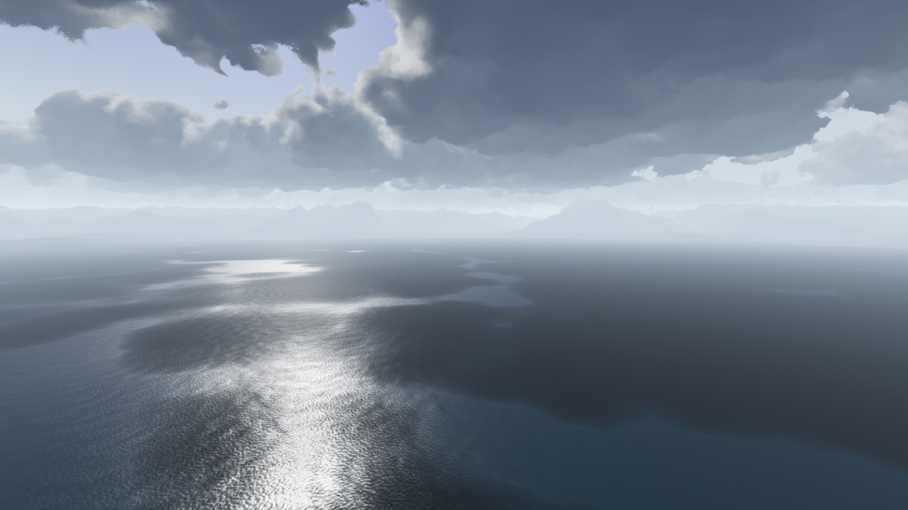
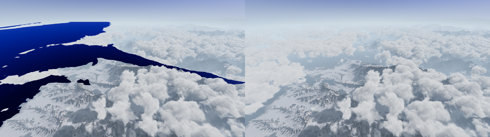

# Acqua del Garda — shader e catture

`resources/materials/garda_water.tres` è assegnato a `Water` in `scenes/maps/garda_final.tscn`, condivisa da tutorial e freeroam. Blu-ardesia, increspature a tre scale e riflessi dielettrici del cielo e del sole, attenuati in distanza.

**Onde e increspature conservate, ma ferme; schiuma rimossa.** Lo shader mantiene le normali e la fase approvata (`vec2(9.6, 3.6)`), senza `TIME`. Nessun appiattimento del dettaglio, cambio di colore o aumento della ruvidità per nascondere il tremolio. Rimosso anche il collegamento delle heightmap al materiale: l'acqua non richiede più uno script.



## Tremolio laterale e antialiasing

Il tremolio era riproducibile **a camera ferma**, anche con shader statico e atmosfera congelata. Nel confronto locale a 720p su Forward+/D3D12, RX 9070 XT, la differenza RGB media massima tra fotogrammi consecutivi nella porzione d'acqua misurata era circa **0,0645 con FSR2**, **0,0148 con TAA**, **0 con FXAA** e **0 senza AA**. Il ciclo FSR2 si ripeteva ogni otto frame: confrontare soltanto catture distanziate di 96 frame non rilevava il problema.

`project.godot` usa ora **FXAA a risoluzione nativa**, senza AA temporale. È una modifica dell'antialiasing **dell'intera scena**, non solo dell'acqua: evita questo tremolio ma rinuncia alla ricostruzione temporale di FSR2. Non modifica terreno, texture importate, cielo, luci o impostazioni delle nuvole. Il confronto F6 rimane disponibile; selezionare nuovamente FSR2/TAA può riprodurre il difetto. Riavviare la partita per applicare il nuovo valore predefinito.

Il test `--still` controlla ora **32 fotogrammi consecutivi** usando il materiale di produzione, senza sostituirne lo shader. La stabilità verificata a camera ferma non certifica l'assenza di ogni aliasing durante il volo; i riflessi continuano correttamente a dipendere dalla visuale.

## Composizione con le nuvole

Il precedente `barnegat_water.tres` usa `atoll_water.gdshader`: lettura di screen/depth e accesso ad `ALPHA` lo portano nel pass trasparente. SunshineClouds viene composto **prima** di quel pass; l'acqua appariva come grandi macchie blu/nere davanti alle nuvole, senza la stessa foschia del paesaggio.

Il nuovo shader è **opaco**, scrive la profondità della superficie e lascia atmosfera e ombre al compositor esistente. Non aggiunge foschia. La geometria passa da **1.458.632 a 2 triangoli**, mantenendo estensione e quota: le increspature sono nelle normali. È un conteggio geometrico, non un benchmark FPS.

**Sinistra: materiale precedente. Destra: attuale.** Camera, luce, fase delle nuvole e FXAA identici; solo affiancamento e ridimensionamento, senza correzioni colore.



Il materiale usa una `NoiseTexture2D` simplex nativa, seamless e con mipmap. Il rumore a larga scala riusa una risorsa esistente. Shader/materiali precedenti e pacchetto importato sono conservati per il confronto; nessuna nuova dipendenza.

## Ripetere la verifica

PowerShell dalla radice del progetto:

```powershell
$godot = "..\..\Godot_v4.7.1-stable_win64_console.exe"

# Contratto opaco/statico, increspature presenti, FXAA, pose, A/B e tasti del viewer.
& $godot --headless --path . --script tools/water_capture.gd -- --check

# Stabilità fra 32 fotogrammi consecutivi, camera ferma sopra l'acqua.
& $godot --path . --script tools/water_capture.gd --fixed-fps 30 -- --preview --still --view=low

# Nove viste a 1080p, nuovo / precedente / nuovo ripetuto.
& $godot --path . --script tools/water_capture.gd --fixed-fps 30

# Confronto rapido e viewer interattivo, anche per la riva senza schiuma.
& $godot --path . --script tools/water_capture.gd --fixed-fps 30 -- --preview --view=shore_detail --hold

# Passaggio diagnostico di 6 secondi, 30 m sopra l'acqua, PNG ogni secondo.
& $godot --path . --script tools/water_capture.gd --fixed-fps 30 -- --motion

# Filmato continuo: scegliere un file nuovo.
& $godot --path . --script tools/water_capture.gd --fixed-fps 30 --write-movie "$env:TEMP\aero-water-review.avi" -- --motion
```

- Viste: `low`, `shore`, `glints`, `coast`, `flight`, `above`, `shore_detail`, `shore_coast`, `shore_shallow`. `--view=<nome>` ne seleziona una; `--preview` usa 720p. Movie Maker usa 1080p.
- `--hold`: frecce sinistra/destra cambiano vista, Spazio alterna precedente/nuovo, Esc chiude. Solo il vecchio shader è congelato mediante una copia runtime strumentata; quello nuovo è già statico in produzione.
- `--still`: sostituisce l'A/B con la misura consecutiva, dopo 96 frame di convergenza; soglia MAE RGB normalizzata `< 0,0001`, un pixel ogni quattro nella porzione centrale inferiore. Usare `low`, dove la porzione misurata contiene acqua. Salva primo/ultimo frame e il massimo in `manifest.json`.
- `--motion`: sostituisce l'A/B con una traslazione della camera a 60 m/s nella vista selezionata (`low` di default). Non simula la fisica del giocatore; la registrazione include il caricamento iniziale.
- Output in **`%APPDATA%\Godot\app_userdata\Aero Demons\water_captures\<data-pid>\`**: PNG originali, confronti `*_legacy-left_new-right.png`, manifest con pose, fasi, renderer, GPU, antialiasing, hash e misure. Ogni esecuzione crea una cartella nuova.
- L'A/B ricostruisce la vecchia griglia solo in memoria; attende 96 frame per campione, controlla ripetizione `< 0,005` e differenza precedente/nuovo `> 0,002`. Non è un punteggio estetico né sostituisce `--still`. Nessuna scena o risorsa viene salvata.
- Le asserzioni richiedono l'eseguibile editor/debug, non un export release. Watchdog di 180 s; non troncare le catture con un `--quit-after` breve.

## Verifica finale — 10 settembre 2026

- Check headless e grafico **PASS**: schiuma rimossa, normali presenti, shader opaco/statico, FXAA, nove camere, tasti e ripristino A/B.
- Test consecutivo 720p: **32 frame, MAE massima 0** nell'area d'acqua; run `2026-09-10T16-28-31-11492`.
- Nove viste **1080p Forward+/D3D12, RX 9070 XT, FXAA**: 27 PNG e nove confronti; run `2026-09-10T18-43-57-18576`. MAE massima nuovo/ripetizione circa **0,0000000101**. Le immagini di questa pagina provengono da questo run.
- Passaggio diagnostico completato: sei PNG, run `2026-09-10T16-28-52-20388`. Freeroam reale avviato per 240 frame, senza errori di script/shader durante il rendering; non è una prova giocata completa.
- Restano i diagnostici preesistenti di deprecazione/interpolazione e rilascio RID, oltre a una risorsa ancora in uso alla chiusura del check headless. Non corretti qui.

## Limiti e regolazioni

Acqua profonda per un gioco di volo: niente schiuma, rifrazione, fondale trasparente, onde geometriche, vista subacquea o nuove collisioni. Le sponde rimangono l'intersezione del piano con il terreno importato; modificarne la conformazione richiede World Creator. I riflessi ambientali provengono da Sky3D, non da riflessioni planari di montagne o dei volumi SunshineClouds. Le macchie scure comprendono le ombre del compositor esistente.

`water_color`, `surface_roughness`, `normal_strength` e le tre scale sono disponibili nell'Inspector. Non esiste più un parametro di velocità o di schiuma. Se il materiale era già aperto nell'editor, ricaricare la scena.
